# test01.c

> str1[] 과 str* str2의 차이 

- 컴퓨터 메모리에서 작동 시 

​         stac       |        hip   

수정가능            수정불가 

변수                     "my String" (문자열)  

배열                       " Your string"

* hip 부분에 만들어진 문자열은 수정 불가능 

* stack 은 가능 

* char str1[] = "my string" 이 배열에 **복사**되어서 수정이 가능 

* 데이터가 와서 수정이 가능! 

* char* str2 = "Your stirng" 은 포인터 변수에 주소값이 복사되어 들어옴 ★

* 데이터가 아닌 주소값이 와서 데이터는 바꿀순 없음 주소값은 변경 가능

* 주소값은 변경할 수 있음! 데이터를 바꿀 순 없음 

  포인터변수가 hip에 있는 your string을 가르키고 있음 

  ( 객체지향 언어의 클래스 개념의 핵심)

```c
#include <stdio.h>

int main() {
	char str1[] = "My String"; //배열 (값 변경 불가)
	char* str2 = "Your String"; // 포인터 변수  (값 변경 가능)
	printf("%s\n", str1);
	printf("%s\n", str2);

	
	str2 = "Our String";
	printf("%s\n", str1);
	printf("%s\n", str2);


	str1[0] = 'x'; //배열 위치로 값을 변경 가능 
	//str2[0] = 'x';  결과 안나옴 //변수 = 값 
	//str2[0]은 주소를 가지고 있는 변수, str2[0]의 주소값을 가지고 있음
	printf("%s\n", str1);

	printf("%s\n", str2);
	printf("%c\n", str2[0]);

	

	return 0;

}
```


## test02.c

```c
#include <stdio.h>

int main() {
	int age;
	char* greeting;

	printf("나이를 입력하세요 : ");
	scanf_s("%d", &age);

	if (age > 30)
		greeting = "처음 뵙겠습니다.";
	else
		greeting = "반가워요";

	printf("인사말:%s\n", greeting);

	return 0;

}
```


## test03.c

```c
#include <stdio.h>

int main() {
	char* str = "watermelon";
	int i = 0;
	
	while (str[i] != '\0') {

	}

	return 0;

}
```


​     s                                                  |                        H 

char * str                                                      " watermelon"

(watermelon의 주소값을 가르킴 )                (배열구조)

​																[w|a|t|e|r|m|e|l|o|n|**\0**]

* char * str  은 Hip에 있는 watermelon의 주소값을 가르킴 
*   " watermelon"은 배열은 아니지만 배열구조처럼 만들어짐

​		따라서, 마지막 문자열에 널문자가 들어감 

* while (str[i] != '\0') 의 뜻 

문자열이 배열처럼 저장이되니깐 인덱스가 지정이 되면서 널이 아닐 때까지 문자열을 작업하겠다는 뜻


>  wtreo 문자열 출력하기 

* 짝수 위치에 있는 문자열만 출력하기 

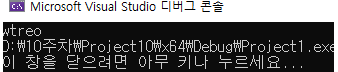

> 코드 

```c
#include <stdio.h>

int main() {
	char* str = "watermelon";
	int i = 0;
	
	while (str[i] != '\0') {
		// wtreo 
		if (i % 2 == 0)
			printf("%c", str[i]);
		i++;
	}

	return 0;

}
```

> 명심할 점 

* printf("%c", **str[i]**);

  why? *str[i] 가 아닌지 생각하기

## hip에 있는건 바꿀수 없기 때문에 stac으로 복사해서 바꾸는건 가능하지만 직접적으로 변경은 불가능!

★문자열 뿐만 아니라 정수 , 실수도 hip에 저장되고 변수에 값을 복사해서 불러오는건지?! 


## test04.c  문자열을 복사해주는 strcpy()  함수

>  문자열은 for문을 통해서 값을 변경할 수 있기 때문에 문자열을 복사해주는 strcpy()  함수를 사용

```c
#include <stdio.h>
#include <string.h> //외부 파일을 포함시키겠다

int main() {
	char str1[20] = "apple";
	char str2[20] = "banana";
	char temp[20];

	//문자열 복사 함수 strcpy()
	strcpy(temp, str1);
	strcpy(str1, str2);
	strcpy(str2, temp);
	
	printf("str1:%s\n", str1);
	printf("str2:%s\n", str2);


	return 0;
}
```


### test05.c 문자열 길이를 계산해주는 strlen() 함수

```c
#include <stdio.h>
#include <string.h> //외부 파일을 포함시키겠다

int main() {
	char str1[80] = "Long time no see.";
	char str2[80] = "What's up?";

	if (strlen(str1) > strlen(str2)) //문자열의 길이
		printf("%s\n", str1);
	else
		printf("%s\n", str2);


	return 0;

}
```


### teset06.c  문자열의 크기를 구하는 strcmp()   함수

* 문자 하나는 숫자로 처리 됨 

```c
#define _CRT_SECURE_NO_WARNINGS

#include <stdio.h>
#include <string.h> //외부 파일을 포함시키겠다

int main() {
	/* 
	* str1 > str2 ==> 리턴값 1
	* str1 < str2 ==> 리턴값 -1
	* str1 == str2 ==> 리턴값 0
	*/
	char str1[20] = "banana";
	char str2[20] = "apple";
	char temp[20];

	int res;

	res = strcmp(str1, str2); // string compare

	if (res > 0) {
		strcpy(temp, str1);
		strcpy(str1, str2);
		strcpy(str2, temp);
	}
	printf("str1:%s\n", str1);
	printf("str2:%s\n", str2);

	return 0;

}
```

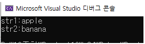

* 글자 하나씩 비교하여 a(97) < b(98) 첫번째 글자만 비교해도 str2가 더 크기때문에 나머지는 비교 하지않는다.


## test06.c 문자열 입출력 함수  gets() puts()

>  scanf 함수는 빈칸이 포함된 문자열은 입력할 수 없다.

* 문자열의 입출력은 전용 함수를 사용한다.

> 한 줄을 모두 입력하는 함수 gets  / 문자열을 출력하는 함수 puts

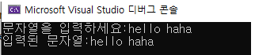

```c
#include <stdio.h>

int main() {
	//scanf 함수는 빈칸이 포함된 문자열은 입력할 수 없다.
	//문자열의 입출력은 전용 함수를 사용한다.
	//한 줄을 모두 입력하는 한수 gets
	//문자열을 출력하는 함수 puts

	char str[80];
	printf("문자열을 입력하세요:");
	gets(str);
	printf("입력된 문자열:");
	puts(str);

	return 0;
}
```


### test07.c 

> 키보드로 하나의 문장들을 입력 받을 때마다 이미 입력 받은 문자들과 연결하여 전체를 출력한다. "끝"이 입력되면 프로그램을 종료한다.

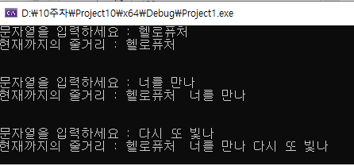

> 코드

```c
#define _CRT_SECURE_NO_WARNINGS
#include <stdio.h>
#include <string.h>

int main() {
	
	char str_in[80];
	char novel[800] = { 0 };


	while (1) { // 무한반복  
		printf("문자열을 입력하세요 : ");
		gets(str_in);

		if (strcmp(str_in, "끝") == 0)
			break;

		strcat(novel, str_in);
		strcat(novel, " ");
	
		printf("현재까지의 줄거리 : ");
		puts(novel);
		puts("\n");
	}

	

	return 0;
}
```


> 명심포인트

* 값이 더해지는 변수는 초기화 필요


## test09.c

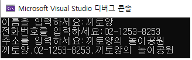


> 코드

```c
#define _CRT_SECURE_NO_WARNINGS
#include <stdio.h>
#include <string.h>

int main() {

	char name[10];
	char tel[20];
	char address[50];
	char str[80] = { 0 };

	printf("이름을 입력하세요:");
	gets(name);
	strcat(str, name);
	strcat(str, ",");

	printf("전화번호를 입력하세요:");
	gets(tel);
	strcat(str, tel);
	strcat(str, ",");


	printf("주소를 입력하세요:");
	gets(address);
	strcat(str, address);

	puts(str);


	return 0;
}
```


## test10.c 문자 입/출력 함수 getchar() putchar() 

>  화면

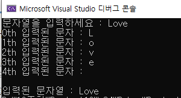

> 코드

```c
#define _CRT_SECURE_NO_WARNINGS
#include <stdio.h>
#include <string.h>

int main() {
	// 하나의 문자만을 전용으로 입출력하는 함수
	// 문자들을 연속으로 입출력하면 문자열의 입출력이 됨
	// 문자 입력 함수 : getchar 
	// 문자 출력 함수 : putchar 

	char str[80];
	int ch;
	int i;
	char s[80] = { 0 };

	printf("문자열을 입력하세요 : ");
	for (i = 0; i < 4; i++) {
		ch=getchar();  // L o v e 
		str[i] = ch; // str Love 
	}

	str[i] = '\0'; //끝(마지막 위치)에다가 널문자를 수동으로 넣어줘야 함 
	
	
	for (i = 0; i < 5; i++) {
		printf("%dth 입력된 문자 : ",i); // Love\0 
		printf("%c \n", str[i]);
	}

	printf("\n");

	printf("입력된 문자열 : ");

	i = 0;  // 반드시 0으로 초기화 
	while (str[i] != '\0') {
		putchar(str[i]);
		i++;
	}
	return 0;
}
```

> 명심포인트 

* i = 0;  반드시 0으로 초기화 

## test11.c  문자열을 준것처럼 입력 가능 

버퍼 원리 

>  문자 

1. 문자입력 a 

[  |   |   |   |  |  |  | a ]

2. 문자 입력 b 

[  |   |   |   |  |  | **엔터** | a ]

[  |   |   |   |  | b | 엔터 | a ]


> 여러개 한번 

1. 문자열입력 Love

[  |   |   |  \0 | e| v |  o | L ]


> 코드 

* ctrl + Z 입력 : -1  이 입력됨

```c
#define _CRT_SECURE_NO_WARNINGS
#include <stdio.h>
#include <string.h>

int main() {
	// 키보드에서 입력되는 데이터는 일단 버퍼에 저장되고 
	// getchar 함수는 버퍼로부터 데이터를 가져오므로 문자열은
	// 한번에 입력된다.

	char str[80];
	char ch;
	int i=0;
	printf("문자열을 입력하세요 : ");
	while (1) {

		ch = getchar();
		if (ch == -1)  // -1 : Ctrl + Z
			break;
		str[i] = ch;
		i++;
	}

	str[i] = '\0';

	printf("입력된 문자열:");
	puts(str);

	return 0;
}
```

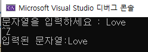


### test12.c

> 아래 화면이 출력되도록 빈칸에 맞게 작성하시오.

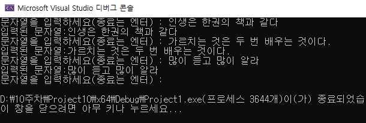

```c
#define _CRT_SECURE_NO_WARNINGS
#include <stdio.h>
#include <string.h>

int main() {

	char str[80];
	char ch;
	int i = 0;

	while (1) {
		printf("문자열을 입력하세요(종료는 엔터) : ");
		ch = getchar();
		if (ch == '\n')
			break;
		str[0] = ch;
		i = 1; 
		
		while (1) {
			ch = getchar();
			if (ch == '\n')
				break;
			// ( 1 ) 
			i++
		}
		// (2 ) 

		printf("입력된 문자열:%s", str);;

	}

	return 0;
}
```

처음에 입력을 받을 때 엔터키면 끝나는거고 엔터키가 아니면 읽어드린 문자를 0번째에 주고 

또 읽어서 1번째 실행 

while 문안에 while,문

처음부터 한글자를 입력할 수 있으니깐 

두글자 이상부터는 두번째 while문 


> 정답 ★ 다시이해하기 

```c
#define _CRT_SECURE_NO_WARNINGS
#include <stdio.h>
#include <string.h>

int main() {

	char str[80];
	char ch;
	int i = 0;

	while (1) {
		printf("문자열을 입력하세요(종료는 엔터) : ");
		ch = getchar();
		if (ch == '\n')
			break;
		str[0] = ch;
		i = 1; 
		
		while (1) {
			ch = getchar();
			if (ch == '\n')
				break;
			str[i] = ch; //(1)
			i++;
		}
		
		str[i] = '\0'; //(2)
		

		printf("입력된 문자열:%s", str);
		printf("\n");

	}


	return 0;
}
```


## test13.c ★😎😍🎁🤢🤔😋😤👼🤶🎅👩‍🌾👨‍🌾👩‍🦯👨‍🦼👩‍🦼🏃‍♂️💃🕺🕺🧗‍♀️🚣‍♀️


> 마지막 prtinf("temp값:", temp); 에러 나는 이유는?  

* { 괄호 } 는 범위/블록 를 친다 

* temp를 쓸수 있는 범위는 {   괄호 }  안까지, 마지막 temp는 범위/블록 을 벗어났기 때문에 에러가 남 

* a, b는 정상적으로 변경되지만 괄호 밖 temp 출력은 에러 

>  괄호는 블럭/범위를 치며 괄호 안에서만 선언된 변수는 괄호 안에서만 사용가능하다. 

```c
#include <stdio.h>


int main() {
	int a = 10, b = 20;

	printf("바꾸기 전 a :%d, b:%d\n", a, b);

	{
		int temp;

		temp = a;
		a = b;
		b = temp;

		printf("temp값:%d\n", temp);
	}


	printf("바꾼 후 a :%d, b:%d", a, b);
	// prtinf("temp값:", temp); 에러 나는 이유는? 
}
```


### test14.c 동일 변수 사용 , 지역변수 사용 범위

> 하나의 프로그램 내에서 동일 이름의 변수 선언 불가 

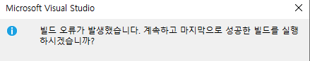

```c
#include <stdio.h>


int main() {
	//하나의 프로그램 내에서 동일 이름의 변수 선언 불가 
	int val = 10;
	int val = 20;
	{


	}

	printf("val=%d",val);
	return 0;


}
```

> { 괄호 } 안에서 사용 

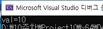

```c
#include <stdio.h>


int main() {
	//하나의 프로그램 내에서 동일 이름의 변수 선언 불가 
	int val = 10;
	
	{

		int val = 20;
	}

	printf("val=%d",val);
	return 0;


}
```

> 지역변수 출력 

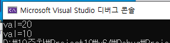

```c
#include <stdio.h>


int main() {
	
	int val = 10;//지역변수
	
	{

		int val = 20;
		printf("val=%d\n", val);
	}

	printf("val=%d",val);
	return 0;

}
```

>  중복 괄호 {  } 사용 

* 안쪽 지역변수가 우선 

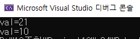

```c
#include <stdio.h>

int main() {
	
	int val = 10;//지역변수
	
	{
		int val = 20;
		{
			val++;
		}

		printf("val=%d\n", val);
	
	}

	printf("val=%d",val);
	return 0;

}
```


## test15.c call by value

> 암기 ) call by value : 값을 전달하는 방식 

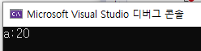

```c
#include <stdio.h>

int add_ten(int);

int main() {

	int a = 10;
	a = add_ten(a); //call by value
	printf("a:%d\n", a);

	return 0;
}

int add_ten(int b) { //매개변수 

	b = b + 10; 

	return b;

}
```


## test 16.c  call by reference (메모리 주소를 넘김)

> 이해하기 

​       a                          *b

​    [  10  ]                  [ 100번지 주소]

100번지 시작            a를 가르킴 


번지수로 a의 값을 바꾸기 

* 포인터 '변수' 니깐 stac 메모리에 있기때문에 값이 수정가능한가?? 

> 코드 

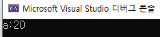

```c
#include <stdio.h>

int add_ten(int*);

int main() {

	int a = 10;

	add_ten(&a);  // call by reference (메모리 주소)
	printf("a:%d\n", a);


	return 0;

}

int add_ten(int* b) { 
	*b = *b + 10;   // 메모리 공간(변수) = 값 

}
```

