# 1주차 학습(10.23) 

#### test_01.c : 기본 세팅

> 괄호를 잘 알아두자! 

- 괄호를 치는 이유 : 시작과 끝 구분, 어디까지 내용인지 확인
- ( 소괄호 ) , { 중괄호 }, [ 대괄호 ]

> 문자와 문자열 차이

- 문자 : 글자 하나 예) H, E, L 

- 문자열 : 문자가 모인 것 예) HELLO

  → 문자열 처리는 "  " 큰따옴표 안에 표시

> // 주석

​	프로그램 실행과 관련 없음, 참고 사항 

> ; 세미콜론 

​	하나의 명령문이 끝나면 반드시 찍어야 함  

> 컴파일 + 저장 : CTRL + F5

```c
#include<stdio.h>

void main() {
	// 주석 : 프로그램 실행과 관련 없음
	printf("Hello,World"); //" " 문자열 처리 기호 
	// 하나의 명령문이 끝나면 반드시 ; 세미 콜론을 찍어야 한다
}
```


#### 참고) 소스파일 추가 시 주의사항

- 소스파일이 여러 개 있는 경우 컴파일 에러가 나기 때문에 꼭 전에 만든 걸 '빌드에서 제외' 처리 해야 함
- 이유 : 전에 만든 소스와 현재 소스를 합쳐서 번역하기 떄문에 전에 만든 걸 번역 처리 안하게 끔 해야 문제 없음
- 방법 : 전에 생성한 소스파일 > 속성 > 빌드에서 제외 > 예  

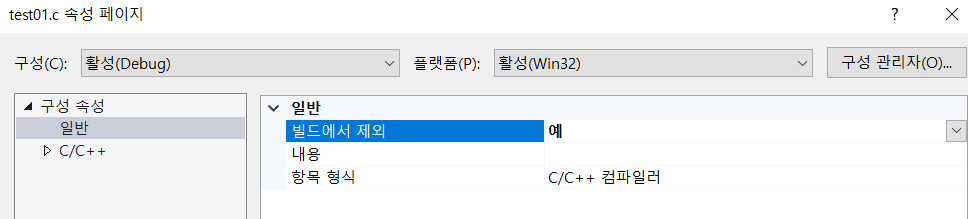

* 빌드 제외로 변경된 모습

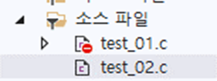

※ 여러 개의 프로젝트를 묶어서 솔루션이라고 함


#### test_02.c : 문자열과 숫자 / printf() 함수 / 정수값 반환 문자열  %d 

> \n : 줄바꿈 

> 문자열은 반드시 " " 큰따옴표 안에 입력한다 

* " " 큰따옴표 안에 있는 건 모든지 문자다!  즉, 공백도 " " 안에 있으면 문자다! 

* printf("%d\n", 10); 의 문자 총 2개. 1. %d : 정수값 출력 문자 2. \n : 줄바꿈 문자

> printf( ) 함수 규칙 : printf(**"** <u>화면 출력값</u> **"** , <u>입력값</u>(생략가능));

* 무조건 " " 큰따옴표 포함  

* 문자열 출력 시 : printf("10");  //결과 : 10 (문자열)
* 숫자 출력 시 : printf("%d",10); // 결과 : 10 (숫자)

> %d(decimal) : 숫자 출력 시 사용하는 정수값 반환 문자열 

```c
#include <stdio.h>
void main() {
	printf("10\n"); //문자열 출력 : "" 큰따옴표 안에 입력 
					// \n : 줄 바꿈 
	printf("123\n"); //printf() 함수에는 "" 큰따옴표 무조건 있어야 한다
	printf("%d\n", 10); // 숫자 출력 : 정수값 반환 문자열 %d(decimal) 사용 
	printf("%d%d\n", 10, 20); // 여러 개의 정수값을 출력할 때는 변환 문자열을 그 수만큼 사용
	printf("%d  %d", 10, 20); // 결과 : 10  20 
							// " " 안에 있는 건 모든지 문자, 즉 공백도 문자다! 
	printf("%d", 10 + 20); //결과 : 30 , 수식의 결과값을 바로 출력할 수 있다.
}
```

* 출력결과

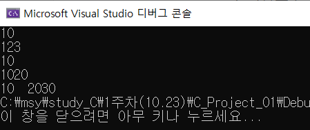


#### test_03.c : 문자열과 상수 출력 활용

> printf("100+100"); 과 printf("%d",100+100) 차이 

```c
#include <stdio.h>

void main() {
	printf("100+100"); // 결과 : 100 + 100 why? " " 큰따옴표 = 문자열 
	printf("\n");
	printf("%d", 100 + 100); // 결과 200
	printf("\n");
	printf("나의 나이는 %d이다", 27); // %d 자리에 숫자를 넣겠다는 뜻
									 // %d = 정수값 변환 문자열 
	printf("\n");
	printf("%d과 %d의 합은 %d 입니다", 2, 3, 2 + 3); 
    	  //순서대로 %d자리에 정수값 넣음
	printf('10'); // 출력 안됨. printf는 무조건 " " 가 있어야 출력 
}
```

* 출력결과 

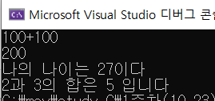


#### test_04.C : 줄바꿈(\n) 활용 및 문제 

> 문자열 안에 \n 을 사용하여 줄바꾸기 

```c
#include <stdio.h>

void main() {
	printf("My age : %d\n", 20);
	printf("Good\nmorning\neverybody\n\n");
}
```

> 출력 결과 

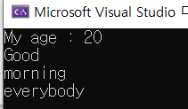


#### test_04_1.C : 정수값 반환 문자열 활용(문제)

> 문제. 아래와 같이 10 is my point  출력하시오, 대신 10은 문자가 아닌 숫자

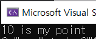

> 정답

```c
#include <stdio.h>

void main() {
	printf("%d is my point", 10);
}
```

> 명심 포인트!!! 

1. **printf("**<u>정수값 반환 문자열</u> is my point**",** <u>정수값</u>);


#### test_05.c : 여러개의 정수값 반환 문자열 활용(문제)

> 문제. 다음의 출력 결과를 보이도록 프로그램 작성하시오.

* 조건 1. printf() 함수 사용 , 조건 2. %d 를 사용

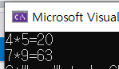

> 정답 

```c
#include <stdio.h>

void main() {
	printf("%d*%d=%d\n", 4, 5, 20);
	printf("%d*%d=%d", 7, 9, 63);
}
```

> 명심 포인트!!!

1. printf() 함수는 반드시 " " 큰따옴표를 포함하며 안은 화면 출력값, 밖은 입력값

   → printf(**"**<u>화면 출력값</u> **"** , <u>입력값</u>);

2. %d는 정수값 반환 문자열이며 %d 자리에 정수값이 들어온다.
3. , 콤마 표시로 나눈다.
4. \n 줄바꿈 잊지 말기 


#### test_06.c : 변수 선언 및 자료 저장 

> 변수 : 값을 저장하는 메모리 공간의 이름

* 변수명 첫 글자는 반드시 영문자나 밑줄(_)로 시작 (특수문자, 숫자 불가) 

> 변수 선언 : 변수에는 반드시 저장할 값의 종류가 무엇인지 명시되어야 한다.

> **매우 중요!** ) **= : 대입연산자** / **규칙 : 저장할 공간 이름 = 값;**

```c
#include <stdio.h>

void main() {

	int hap; //변수 선언(int : 정수 저장)
	int hap2; 
	int hap3 = 200; //변수 선언과 동시에 값 저장 
	hap = 100;
	printf("%d", hap); //결과 : 100 
	printf("\n");
	hap = 10 + 20; // 새로운 값이 들어가면 전에 있던 값을 덮어씀
	printf("%d", hap); //결과 : 30
	printf("\n");
	hap2 = hap;
	printf("%d   %d\n", hap, hap2); // 결과 : 30  30 (공백도 문자열)
	printf("%d", hap3); //결과 : 200
    
}
```

> 출력결과 

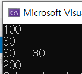


#### test_07.c : 변수 선언과 정수값 반환 문자열 활용(문제)

> 문제.  다음의 출력 결과를 보이도록 프로그램 작성하시오.

* 조건. 아래의 변수명 사용

  <u>키 : height , 몸무게 : weight , 차이 값 : cha</u> 

  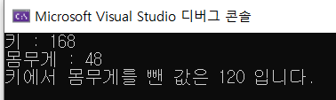

> 정답 

```c
#include <stdio.h>

void main() {
	int height;
	int weight;
	int cha;

	height = 168; 
	weight = 48;
	cha = 168 - 48;

	printf("키 : %d\n", height);
	printf("몸무게 : %d\n", weight);
	printf("키에서 몸무게를 뺀 값은 %d 입니다.\n", cha);

}
```

> 명심 포인트!!!

``` c
int height;
height = 168; 
 // 〓 위 아래 동일 
int height = 168; 
```


#### test_08 : scanf_s() 함수, 키보드로 부터 값 입력 받기 

> scanf_s() 함수 규칙 : scanf_s("입력받을 값 타입",&변수명(저장공간)); 

* scanf_s() 함수도 printf() 함수처럼 반드시 " " 큰따옴표 포함
* 입력 받은 값의 저장 공간은 <u>**&**변수명</u> 으로 표현

```c
#include <stdio.h>

void main() {
	// 키보드로 부터 값을 받아오기
	int num1;
	int num2;
	int num3;

	printf("정수값 하나를 입력하시오 : ");
	scanf_s("%d", &num1); // 키보드로 부터 값을 입력받기 위해 필요한 함수 
			   // 규칙 : scanf_s("입력받을 값 타입",&변수명(저장공간));
	printf("입력 받은 정수값은 %d 입니다.\n", num1);
	printf("정수값 두개를 입력하시오 : ");
	scanf_s("%d%d", &num1, &num2); 
    	//값을 연속해서 입력 할때는 공백으로 구분(스페이스바)
	num3 = num1 + num2;
	printf("입력 받은 정수값은 num1=%d num2=%d num3=%d", num1, num2, num3);

}
```

> 출력화면

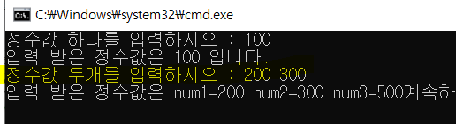


#### test_09 : 실수 값 입출력

> 실수형 자료형 : double  / 실수형 변환 문자열 : %lf (영어 엘,에프)

* 정수형 자료형 : int  / 정수형 변환 문자열 : %d

```c
#include <stdio.h>

void main() {
	//1. 변수 선언
	int bongbong, bonus, total; //연달아 정수 변수 선언
	double tax, real_incom; // double : 실수 타입 

	//2. 초기화 
	bongbong = 150;
	bonus = 60;

	//3. 계산;
	total = bongbong + bonus; // 총 수입액
	tax = total * 0.09; //세금 (정수 * 실수 -> 실수)

	//실 수입액 구하시오.
	real_incom = total - tax;

	//출력 
	printf("이몽룡의 실수입액은 %lf 만원입니다", real_incom);
	// 정수 출력 : %d, 실수 출력 : %lf(영어 엘, 에프)

}
```

> 출력 화면

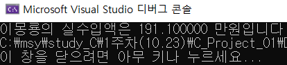


#### test_10. 1주차 수업 내용 총 활용 문제 (문제)

> 문제. 다음 화면과 같은 프로그램 작성하시오

* 조건 1

  기본요금 : 660원

  kw당 사용요금 : 88.5원

  전체요금 : 기본요금 + (전기사용량*kw당 사용요금)

  세금은 전체 요금의 9%

  최종 사용요금 = 전체요금 + 세금 

* 조건 2

  <u>전기사용량 : amount / 최종 사용 요금 : total , 세금 : tax, 전체요금 : price</u>

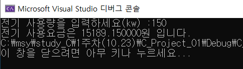

> 정답

```c
#include <stdio.h>

void main() {
	int amount;
	double total, tax, price;
	
	printf("전기 사용량을 입력하세요(kw) :");
	scanf_s("%d", &amount);
	
	price = 660 + (amount * 88.5);
	tax = price * 0.09; 
	total = price + tax;

	printf("전기 사용요금은 %lf원 입니다.", total);
}

```

> 명심 포인트!!!

1. printf( ) 함수 규칙 : printf(**"** <u>화면 출력값</u> **"** , <u>입력값</u>(생략가능));
2. scanf_s() 함수 규칙 : scanf_s("입력받을 값 타입",&변수명(저장공간)); 
3. scanf_s() 함수와 printf() 함수 모두 반드시 " " 큰따옴표 포함

4. 변수 선언 시 자료형 반드시 확인  

   - 실수형 자료형 : double  / 실수형 변환 문자열 : %lf (영어 엘,에프)

   * 정수형 자료형 : int  / 정수형 변환 문자열 : %d
   
     

#### test.11 : ASCII코드 

> 문자도 컴퓨터가 이해할 수 있는 상수로 표현된다. 

> 상수(constant) : 수식에서 변하지 않는 값 
>
> 문자상수 : 'a' (97) ,  'A'(65) → 컴퓨터가 이해할 수 있도록 상수로 표현 됨 

 	참고) ASCII 코드 : [ASCII - 위키백과, 우리 모두의 백과사전 (wikipedia.org)](https://ko.wikipedia.org/wiki/ASCII)

> 문자 : ' ' 작은따옴표, 문자열 : " " 큰따옴표 안에 있는 문자.  즉, "a"와 'a' 는 다르다.

> 쉬운 이해 : 입력값 → **자료 반환 문자열** → 출력값
>
> ※ 입력값은 자료 반환 문자열에 따라 출력값이 변한다 ex) 문자  → **%d(정수형 반환 문자열)**  → 정수 

```c
#include <stdio.h>

void main() {
	printf("정수형 상수값:%d\n", 65); //해석 : 65를 정수로 출력 
									// 65 -> %d 
	printf("상수값을 문자로:%c\n", 65); //해석 : 65(정수)를 문자로 출력 
							// 65 -> %c(문자형 반환 문자열) -> A (ASCII코드 참고)
	printf("문자를 숫자로:%d\n", 'A'); //해석 : 문자 'A' 를 정수로 출력
								// 'A' -> %d(정수형 반환 문자열) -> 65

}
```

 

> 출력 화면 

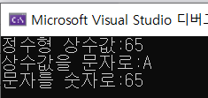

