공부사이트 : [씹어먹는 C 언어 - <15 - 2. 일로와봐, 문자열(string) - 버퍼에 관한 이해> (modoocode.com)](https://modoocode.com/32)


### project3

#### test23.c  커피 자판기 잔돈 계산(대입 연산자와 나머지 수식 이해)

> 문제. 아래의 ( ??????) 을 채우시오

```c
#include <stdio.h>

void main() {
	int input, change;
	int w500, w100, w50, w10;


	printf("돈을 입력하세요 : ");
	scanf_s("%d", &input);

	( ?????? )  // 커피값이 150원일 때 잔돈 계산 

	w500 = change / 500;   // / 나누기 
	change = change % 500;  // % 나머지 
	w100 = change / 100;
	change = change % 100;
	w50 = change / 50 ;
	change = change % 50;
	w10 = change / 10;

	printf("500원짜리 동전 %d\n", w500);
	printf("100원짜리 동전 %d\n", w100);
	printf("50원짜리 동전 %d\n", w50);
	printf("10원짜리 동전 %d\n", w10);
}
```


> 정답. 1000원의 잔돈은 ? 

```c
#include <stdio.h>

void main() {
	int input, change;
	int w500, w100, w50, w10;


	printf("돈을 입력하세요 : ");
	scanf_s("%d", &input);  // 1000

	change = input - 150;  // 커피값이 150원일 때 잔돈 계산 

	w500 = change / 500;   // [ / 나누기(몫) ] 계산 : 850/500 ==> 1  나머지 350 
	change = change % 500;  // [ % 나머지 ] 계산 : 850 % 500 ==> 350, change = 350 으로 변경 
	w100 = change / 100; // 계산 : 350 / 100 ==> 3 나머지 50 
	change = change % 100; // 계산 : 350 & 100 => 50 , change = 50 으로 변경
	w50 = change / 50 ; // 계산 : 50 / 50 ==> 1 , 나머지 0
	change = change % 50; // 계산 : 50 % 50 ==> 0 , change = 0으로 변경  
	w10 = change / 10;

	printf("500원짜리 동전 %d\n", w500); // 1
	printf("100원짜리 동전 %d\n", w100); // 3
	printf("50원짜리 동전 %d\n", w50); // 1 
	printf("10원짜리 동전 %d\n", w10);
}
```

> 출력화면

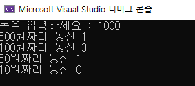

> 명심포인트 ! 

1. [ **= : 대입연산자** ] 

* **저장할 공간 이름 = 값;**

  참고) 1주차 test_06.c


#### test_24.c 시분초 구하기

> 문제. 32767초의 시,분,초를 구하시오 

```c
#include <stdio.h>

void main() {
	int sec = 32767;
	int hour, min;

	hour = sec / 3600;

	// 1. 
	// 2. 
	// 3.

	printf("32767초는 %d시간,%d분,%d초입니다.\n ", hour, min, sec);
}
```


> 정답. 9시간 6분 7초 

```c
#include <stdio.h>

void main() {
	int sec = 32767;
	int hour, min;

	hour = sec / 3600; // 시간 구하기. 1시간은 3600 초
	sec = sec % 3600; //1. 정답
	min = sec / 60; //2. 정답
	sec = sec % 60;  //3. 정답

	printf("32767초는 %d시간,%d분,%d초입니다.\n ", hour, min, sec);

}
```

> 출력화면

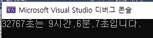


#### test_25.c 형변환 연산자 활용

> 문제. 아래 코드에서 문제를 찾으시오 ( 결과가  0.000000 )

```c
#include<stdio.h>

void main() {
	int employed = 160; //취업생
	int graduation = 245; //졸업생
	double percentage;


	percentage = (employed / graduation) * 100;


	printf("%lf", percentage); 


}
```

> 문제의 출력화면 

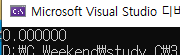

> 정답 < 질문 . 하나만 실수로 바꿔주면되면 3개있을때도 하나만 써도 되는지 >

```c
#include<stdio.h>

void main() {
	int employed = 160; //취업생
	int graduation = 245; //졸업생
	double percentage;

	percentage = ( employed / (double)graduation) * 100; 
     // (  ) 형변환 연산자, cast
 
	printf("%lf", percentage); 


}
```

> 출력결과

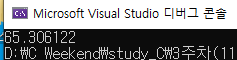


> 명심포인트!!

1. 계산 식에 정수형 / 정수형 은 정수형이 나온다.(실수형이 될 수 없음)
2. 실수형을 구하려면 실수형으로 만들어 줘야 한다. 
   * **(double) 형변환 연산자**사용

3. ★중요 : <u>형변환 연산자(cast)를 사용한다고 해서 정수가 실수로 바뀌는 게 아니다!</u> 
   * int(자료형 타입) graduation -> (double)graduation 한다고 해서 graduation 변수가 실수형이 되는게 아님
   * graduation의 <u>값을</u> <u>임시로</u> 만든 실수형 자료에 <u>가져온다.</u>


#### test_26.c 변수타입과 변환문자열 일치의 중요성 <시간 이해하기>

참고 ) https://kim-expain.tistory.com/80 시간이해하기

> 오류 코드

```c
#include<stdio.h>

void main() {
	double time = 0.375; //단위는 시간
	int min; 

	time = time * 60; //22.5  
	printf("time = %lf\n", time);
	min = (int)time; //22
	printf("분 : %d\n", min); 
	time = time - min; 
	printf("초 : %lf\n", time); //오류 발생

}
```

> 오류 출력화면

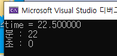


> 정답 코드

```c
#include<stdio.h>

void main() {
	double time = 0.375; //단위는 시간
	int min; 

	time = time * 60; //22.5   1분 = 60초
	printf("time = %lf\n", time);
	min = (int)time; //22
	printf("분 : %d\n", min); 
	time = time - min; 
	printf("초 : %lf\n", time*60); //★ 30.000000 (1분 60초)  
	printf("초 : %d\n", (int)(time * 60)); // ★30

}
```

> 정답 출력화면

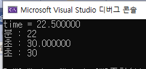

> 명심포인트!! 

1. 변수타입과 변환문자열을 일치해야 한다 

   * double = %lf
   * int = %d

   **double** time

   **time** = time - min; 
   printf("초 : **%lf**\n", time*60); //★ 30.000000 (1분 60초)  

2. 다른 타입으로 출력하고 싶을 때는 형변환( ) 연산자를 활용한다.

* 잘 못 된 예 

  printf("초 : **%d**\n", **time * 60**); 

  * 결과 : 0 why? 결과와 변환문자열 자료가 다르다 

  printf("초 : **%d**\n", **(int)time * 60**); 

  * 결과 : 0 why? double 인 time을 int로 바꾸면 0

    -> 해결방법 : 변환문자열을 바꾸거나 (%d -> %lf, 결과 30.000000) 형변환 연산자(int) 를 사용한다

* 잘된 예 

  printf("초 : **%d**\n", **(int)**(time * 60));  // 결과 : 30 

  * 결과 : 30 

    1. 결과 30.000000 실수를 정수로 출력하고 싶을 경우 (int) 형변환 연산자를 사용

    2. 변환문자열과 일치시켜준다

#### test_27.c (다시 이해하기! 동전계산하듯 생각해보자 ㅜ)

```c
#include<stdio.h>

void main() {

	//시간을 구하려면 24 , 분을 구하려면 60, 초를 구하려면 60

	double annual = 365.2422; //365일 .2422시간
	int day, hour, min, sec;

	day = (int)annual; //365 
	annual = annual - day; // 0.242200; 
	printf("day=%d annual=%lf\n",day,annual); //day=365, annual=0.242200

	annual = annual * 24; //하루가 24시간 
	printf("annual=%lf\n",annual ); //5.812800 
	hour = (int)annual; //5,  필요없는 0.812800제거 

	annual = annual - hour; //0.812800
	annual = annual * 60; // 1분은 60초 1시간은 60분
	printf("annual=%lf\n", annual); //48.768000
	min = (int)annual; //48

	annual = annual - min;
	printf("annual=%lf\n", annual); //0.768000
	annual = annual * 60; // 1분은 60초 
	sec = (int)annual;

	printf("1년은 %d일, %d시간, %d분, %d초입니다.\n", day, hour, min, sec);

}

```

> 출력화면


#### test_28.c :  8진수 16진수 

> 표기법

* 8진수 : **0** , 16진수 : **0x**

> 표현방식  

* 10진수 : 0~9   **10**    11    12    13    14    **15**    <u>1</u><u>6</u>    17 
* 8 진수  :
* 16진수 : 0~9     **a**      b      c      d      e       **f**      <u>10</u>    11  ★ 암기 하기 10부터 a~f

> 진수와 형변환 문자열 

* 10진수(decimal) : %d , 8진수(octal) : %o , 16진수(hexa-decimal) : %x 

> 진수를 정확하게 출력하고 싶은 경우 **%#**(형변환문자열)

* printf("8진수 출력:**%#o**", 12); //  **0**14
* printf("16진수 출력:**%#x**", 12); //  **0x**c

```c
#include <stdio.h>

void main() {
	printf("10진수 상수 12 :%d\n", 12); //12
	printf("8진수 상수 014 :%d\n", 014); // 12
	printf("16진수 상수 0xc:%d\n", 0xc); // 12

	printf("10진수 12를 10진수로 출력:%d\n", 12); // decimal, 12
	printf("10진수 12를 8진수로 출력:%o\n", 12); // octal, 14
	printf("10진수 12를 16진수로 출력:%x\n", 12); // hexa-decimal, c


	printf("10진수 12를 8진수로 출력:%#o\n", 12); //  014
	printf("10진수 12를 16진수로 출력:%#x\n", 12); // 0xc

}
```

> 출력결과

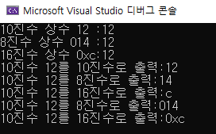

<이해하기>

결과가 왜이렇게 나오냥.. 아스키코드 3문자는 정수로 51

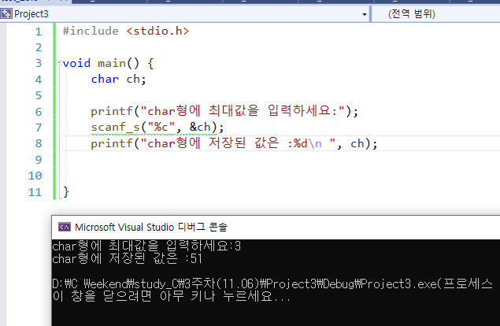


#### test_29.c : unsigned char < 잘실행 안됨!!> 

> unsigned의 형변환 문자열 :  %u

> 출력화면 

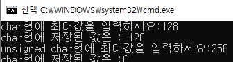

> 코드

```c
#include <stdio.h>

void main() {
	char ch; //1byte : -128~127
	unsigned char uch; // 0~255
	printf("char형에 최대값을 입력하세요:");
	scanf_s("%d", &ch);
	printf("char형에 저장된 값은 :%d\n", ch);


	printf("unsigned char형에 최대값을 입력하세요:");
	scanf_s("%u", &uch);
	printf("char형에 저장된 값은 :%d\n ", uch);

}
```


#### test_30.c : 바이트  수 

> 이유 확인하기@@@

printf("%d바이트\n", sizeof("abcdef")); // 문자열 :  7바이트 (문자가 늘어날때마다 byte증가)
	printf("%d바이트\n", sizeof("K")); // 문자열 :  2바이트 

```c
#include <stdio.h>

void main() {

	//sizeof() : 자료형의 크기를 계산하는 연산자
	printf("%d바이트\n", sizeof('V')); // 문자 : 4바이트 
     //why? 문자상수는 1byte인데 4byte로 잡는건 ? 컴퓨터 성능이 좋아짐 (컴파일러에 따라 바뀜)
	printf("%d바이트\n", sizeof(35)); // 정수 : 4바이트(기본)
	printf("%d바이트\n", sizeof(1.65)); // 실수 :  8바이트(기본)
	printf("%d바이트\n", sizeof(1.65f)); // f : float(4byte), 실수지만 4byte를 사용 
	printf("%d바이트\n", sizeof("abcd")); // 문자열 :  4바이트 
	printf("%d바이트\n", sizeof("abcdef")); // 문자열 :  7바이트 (문자가 늘어날때마다 byte증가)
	printf("%d바이트\n", sizeof("K")); // 문자열 :  2바이트 
	printf("%d바이트\n", sizeof(10/4)); // 정수/정수=정수  4바이트
	printf("%d바이트\n", sizeof(10/4.0)); // 정수/실수=실수  8바이트 


}
```


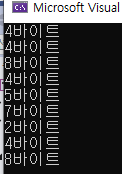


#### 참고) 프로젝트 추가 설정

> 솔루션 추가 

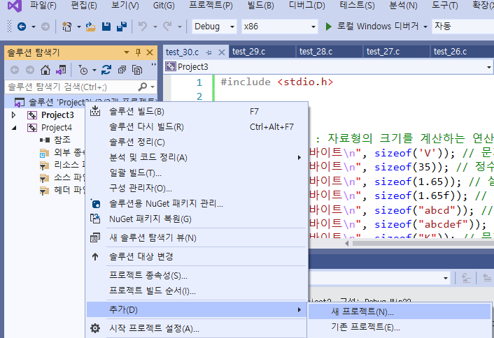

> 색이 굵은 색으로 변경 > 시작프로젝트로 설정

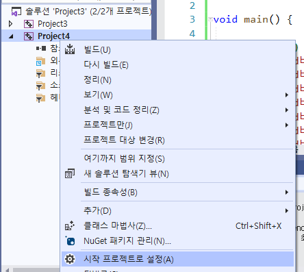
