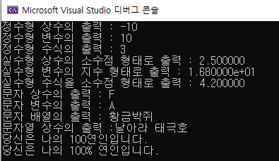
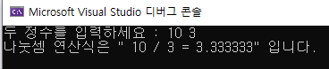
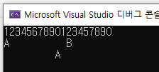
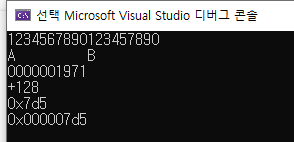
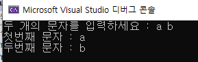
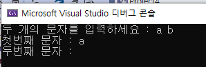

### project4

#### test_01.c : prinf() 함수로 100% 출력하기

> prinft("100**%**"); 와  printf("100**%%**") 의 출력 결과는 다르다
>
> 100**%** 출력 시 100**%%** 로 입력 why? 형변환 문자열이 %d 이렇게 사용하여 형변환 문자열로 인식

* printf("당신은 나의 100% 연인입니다.\n");  ==> 100%를 100으로만 인식 
* printf("당신은 나의 100%% 연인입니다.\n"); ==> 100%로 인식하게 됨

```c
#include<stdio.h>

//다양한 변환 문자열
void main() {
	char ch = 'A';
	char name[80] = "황금박쥐";
	int in = 10;
	double db = 16.8;

	//데이터 출력시 값에 맞게 형변환 문자열 (%) 사용 

	printf("정수형 상수의 출력 : %d\n", -10);
	printf("정수형 변수의 출력 : %d\n", in);
	printf("정수형 수식의 출력 : %d\n", in/3);

	printf("실수형 상수의 소수점 형태로 출력 : %lf\n", 2.5); //%d로 입력시 0 이 나옴(주의)
	printf("실수형 변수의 지수 형태로 출력 : %le\n", db); // 지수는 %le
	printf("실수형 수식을 소수점 형태로 출력 : %lf\n", db/4);

	printf("문자 상수의 출력 : %c\n", 'F');
	printf("문자 변수의 출력 : %c\n", ch);
	printf("문자 배열의 출력 : %s\n", name); // 문자열은 %s 사용
	printf("문자열 상수의 출력 :%s\n", "날아라 태극호"); //문자열 직접 출력 %s사용
	
	
	printf("당신은 나의 100% 연인입니다.\n"); // 100%를 100으로만 인식 
	printf("당신은 나의 100%% 연인입니다.\n"); // 100%로 인식하게 됨

}
```

> 출력화면




#### test_02 : prinf() 함수로  " " 큰따옴표 출력하기

> 문제. 아래의 화면이 나오도록 작성하시오.




> 정답 

```c
#include<stdio.h>

void main() {
	int a, b;

	printf("두 정수를 입력하세요 : ");
	scanf_s("%d %d", &a, &b);

	printf("나눗셈 연산식은 \" %d / %d = %lf\" 입니다.\n", a, b, (double)a / b);

}
```

> 명심포인트!! 

* " 를 출력시 \를 앞에 붙인다. --> **\n**


#### test_03.c : 정렬 (질문하기)

참고) 2주차-코드 test17.c

> 질문하기!!!!! 	printf("%5lf\n", 3.141); 결과 이유 

```c
#include<stdio.h>

void main() {
	printf("1234567890123457890\n");

	printf("%10c\n",'A');
	printf("%10d\n", 128);

	printf("%10lf\n", 3.1415926);
	printf("%10le\n", 3.1415926);

	printf("%10.3lf\n", 3.1415926); // 소수점 세자리 표현, 오른쪽 정렬
	printf("%10.5s\n", "Love is"); // 소수점 다섯자리 표현, 오른쪽 정렬
	printf("%10.7s\n", "Love is");
	printf("%5lf\n", 3.141); //왼쪽 정렬인 이유는 3.141000 -> 8자리 표현 , 초과하여 왼쪽정렬
	printf("%5lf\n", 3.1415926);


}

```

> 출력결과


> 참고

```c
#include<stdio.h>

void main() {
	printf("1234567890123457890\n");

	printf("%c %10c\n",'A', 'B');
	printf("%10c\n", 'A');

}
```


> 출력결과 



#### test_04.c : 정렬 활용 (질문하기@!)

```c
#include<stdio.h>

void main() {
	printf("1234567890123457890\n");

	printf("%-10c%c\n", 'A', 'B'); // - : 왼쪽 정렬 
	printf("%010d\n", 1971); // 오른쪽 정렬, 남은 건 0으로 채우기 
	printf("%+d\n", 128); // + 기호 표시 
	printf("%#x\n", 2005); // 진법 + 16진수 
	printf("%#010x\n", 0x7d5); // 8진수 7d5를 진법 표현 붙여서 10자리로 채우고 나머지는 0으로 채움

}
```

> 출력 결과 




참고 블로그) [scanf_s 함수 사용 시 주의 사항 : 네이버 블로그 (naver.com)](https://m.blog.naver.com/PostView.naver?isHttpsRedirect=true&blogId=tipsware&logNo=221200252889)

#### test_05.c : 2개 이상 문자 받을 때 

```c
#include<stdio.h>

void main() {
	char ch1, ch2;
	printf("두 개의 문자를 입력하세요 : ");
	scanf_s("%c %c", &ch1, 1, &ch2,1); 
	printf("첫번째 문자 : %c\n", ch1);
	printf("두번째 문자 : %c\n", ch2);

}

```

> 출력결과




> 주의! 공백도 문자다!! 

* scanf_s("%c%c", &ch1, 1, &ch2,1) 처럼 **%c%c 가 붙어있을 때** **a(스페이스)b 입력 시** 두번째 문자에 공백이 나옴


