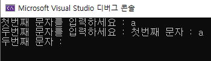
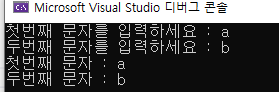
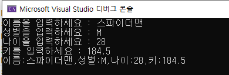

#### test_06.c : 두문자를 따로 받을 때 생길 수 있는 오류

```c
#include<stdio.h>

void main() {
	char ch1, ch2;
	printf("첫번째 문자를 입력하세요 : ");
	scanf_s("%c", &ch1, 1);
	printf("두번째 문자를 입력하세요 : ");
	scanf_s("%c", &ch2, 1); // 수정 필요
	printf("첫번째 문자 : %c\n", ch1);
	printf("두번째 문자 : %c\n", ch2);

}
```

> 문제 화면 - a입력 하고 엔터를 누를 때



```c
#include<stdio.h>

void main() {
	char ch1, ch2;
	printf("첫번째 문자를 입력하세요 : ");
	scanf_s("%c", &ch1, 1);
	printf("두번째 문자를 입력하세요 : ");
	scanf_s(" %c", &ch2, 1); // ★ %c 앞에 띄어쓰기 
	printf("첫번째 문자 : %c\n", ch1);
	printf("두번째 문자 : %c\n", ch2);

}
```

> 정상 출력 화면 




#### test_07.c : 입출력 문제

> 아래 화면이 출력되도록 빈칸을 채우시오.



```c
#include <stdio.h>

int main() {

	char name[80];
	char sex;
	int age;
	double height;

	printf("이름을 입력하세요 : ");
	// 
	printf("성별을 입력하세요 : ");
	// 
	printf("나이을 입력하세요 : ");
	// 
	printf("키를 입력하세요 : ");
	//
	printf("이름:%s,성별:%c,나이:%d,키:%.1lf\n", name, sex, age, height);

}
```

