#### project4

#### test_06.c : 두문자를 따로 받을 때 생길 수 있는 오류

```c
#include<stdio.h>

void main() {
	char ch1, ch2;
	printf("첫번째 문자를 입력하세요 : ");
	scanf_s("%c", &ch1, 1);
	printf("두번째 문자를 입력하세요 : ");
	scanf_s("%c", &ch2, 1); // 수정 필요
	printf("첫번째 문자 : %c\n", ch1);
	printf("두번째 문자 : %c\n", ch2);

}
```

> 문제 화면 - a입력 하고 엔터를 누를 때


```c
#include<stdio.h>

void main() {
	char ch1, ch2;
	printf("첫번째 문자를 입력하세요 : ");
	scanf_s("%c", &ch1, 1);
	printf("두번째 문자를 입력하세요 : ");
	scanf_s(" %c", &ch2, 1); // ★ %c 앞에 띄어쓰기 
	printf("첫번째 문자 : %c\n", ch1);
	printf("두번째 문자 : %c\n", ch2);

}
```

> 정상 출력 화면 


#### test_07.c : 입출력 문제

> 아래 화면이 출력되도록 빈칸을 채우시오.


```c
#include <stdio.h>

int main() {

	char name[80];
	char sex;
	int age;
	double height;

	printf("이름을 입력하세요 : ");
	// 
	printf("성별을 입력하세요 : ");
	// 
	printf("나이을 입력하세요 : ");
	// 
	printf("키를 입력하세요 : ");
	//
	printf("이름:%s,성별:%c,나이:%d,키:%.1lf\n", name, sex, age, height);

}
```


> 정답

```c
#include <stdio.h>

int main() {

	char name[80];
	char sex;
	int age;
	double height;

	printf("이름을 입력하세요 : ");
	scanf_s("%s", name, 20); //입력받을 크기 지정
	printf("성별을 입력하세요 : ");
	scanf_s(" %c",&sex,1);
	printf("나이을 입력하세요 : ");
	scanf_s(" %d", &age);
	printf("키를 입력하세요 : ");
	scanf_s(" %lf", &height);
	printf("이름:%s,성별:%c,나이:%d,키:%.1lf \n", name, sex, age, height);

}
```


> 명심포인트 

1. 하나씩 출력받을 때는 변화문자열 앞에 <u>띄어쓰기</u> 입력
   * "%d" -> " %d"


​										- 기본 - 

-------------------------------------------------------------------------------------------------------------------------------------------------------

### Projec_05 ( 수업 : c_project_03)

#### test_01.c : 정수 비교 참,거짓

> 암기 ) 참은 1, 거짓은 0

> 실제로는 0이 아닌 모든 값을 참(1)으로 인식한다.

​	-> ★ 0을 제외한 모든 숫자는 참인 1

```c
#include<stdio.h>

void main() {
	//선택문

	printf("연산 결과가 참인 경우 : %d\n", 20 > 10); // 1 참 
	printf("연산 결과가 거짓인 경우 : %d\n", 10 > 20); // 0 거짓

	//실제로는 0이 아닌 모든 값을 참으로 인식한다.
}
```

> 출력화면

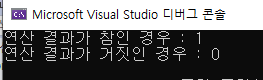

#### test_02.c  : 관계연산자

> 같은지 : ==  / 다른지 :    != 

```c
#include<stdio.h>

void main() {
	int nData = 10; 
	int nNewDate = 20;
	int nResult = 10;

    //관계연산자
	printf("%d\n", nData == nResult); //1 == 같은지
	printf("%d\n", nData != nResult); // 0 != 다른지
	printf("%d\n", nData > nResult); // 0
	printf("%d\n", nData < nResult); // 0
	printf("%d\n", nData >= nResult); //1
	printf("%d\n", nData <= nResult); //1

}
```

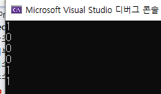

#### test_03.c :  논리 연산자

> && : AND / ! : not( 반대)

```c
#include<stdio.h>

void main() {
	int a = 10;

	//논리 연산자
	printf("논리곱 연산 : %d\n", (a > 5) && (a <= 15)); // and, 1
	printf("논리합 연산 : %d\n", (a != 5) && (a == 15)); // and, 0
	printf("논리 부정 연산 : %d\n", !((a-5)>0)); // not, 0
	printf("피연산자가 상수인 경우 : %d\n", 3.4 && (a > 0)); // and , 1 ★ 0을 제외한 모든 숫자는 참 

}
```

* 명심 : ★ 0을 제외한 모든 숫자는 참 

  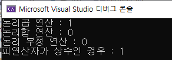

#### test_04.c : 논리연산자

> || : or 연산자

```c
#include<stdio.h>

void main() {
	int nData = 10, nNewData = 20;
	int x = 0, y = 0;

	printf("%d\n", !nData && nNewData); //0
	printf("%d\n", !(nData && x)); //1
	printf("%d\n", !nData || x); // 0
	printf("%d\n", x || !y); //1 
	printf("%d\n", !(x && !y)); //1 

}
```


#### test_05.c : if 선택문(제어문)

> 중요암기★★★ )  

​	if (참,거짓) 	

1.  if문에서 조건이 <u>참일 때 무조건 (세미콜론으로 끝나는)첫번째 명령문</u>을 실행한다.★★★

   - 첫 번째 **세미콜론 까지만** 제어 구조의 문장으로 해석 **참고)test_07.c**

   * 거짓이면 첫번째 명령문 실행하지 않고 다음 명령문 실행 

2.  프로그램의 실행 순서는 <u>위에서 아래로</u> <u>순차적</u>으로 실행 된다. ★★

    -> if문이 참이라 첫번째 명령문 실행 후 순차적으로 두번째 명령문도 실행  **참고)test_08.c**

```c
#include<stdio.h>

void main() {
	int nData = 20;
	int nNewData = 20;

	//선택문 if(참,거짓), 제어문 

	if (nNewData >= nData)
		printf("%s\n", "참일 때 실행되는 명령문");
	printf("%s\n", "거짓 일때 실행되는 명령문입니다");
	//if문은 첫 번째 세미콜론 까지만 제어 구조의 문장으로 해석
}
```

3. { } 중괄호 의미 :  범위 지정(시작과 끝)

```c
if (nNewData >= nData)
		printf("%s\n", "참일 때 실행되는 명령문"); 

[중괄호]
if (nNewData >= nData) {
		printf("%s\n", "참일 때 실행되는 명령문"); 
		}
```

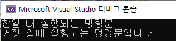

#### test_06.c : if문 사용

```c
#include <stdio.h>

void main() {
	int nData = 10, nNewData = 20;

	if (nNewData = nData) {
		//nNewData 10이 됨, 0이 아닌 숫자는 참
		puts("Sucess"); 

	}
}
```

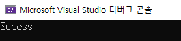

* int nData = 0, nNewData = 20; 일 때 결과 

  결과 : 0 , why? 0을 제외한 모든값은 참 

  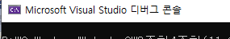


#### test_07.c : 세미콜론 사용 주의 

>  세미콜론은 명령문의 끝을 의미한다. 

* if문에서 조건이 <u>참일 때 무조건 (세미콜론으로 끝나는)첫번째 명령문</u>을 실행

```c
#include <stdio.h>

void main() {
	int nData = 10; // int nData = 20; 도 동일한 결과값

	if (nData == 20); {
		puts("Sucess");
	}

}
```

> 출력화면

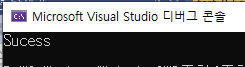

> 명심할 점 

1. 왜 참이 아닌데 Sucess가 나왔을까? <u>세미콜론 때문이다.</u> 

```c
if (nData == 20); {
		puts("Sucess");
	}

[풀이]
if (nData == 20)    ;   // if문에서 참일 떄 첫 번째 세미콜론 까지만 제어 구조의 문장으로 해석. 
					    // 따라서 공백 출력 후 다음 문장인 Sucess를 출력
    { 
		puts("Sucess");
	}
```


#### test_08.c : 프로그램의 실행 순서는 <u>위에서 아래로</u> <u>순차적</u>으로 실행 

```c
#include <stdio.h>

void main() {
	int num;
	printf("정수 입력 : ");
	scanf_s("%d", &num);

	if (num < 0)
		printf("입력 값은 0보다 작다.\n");

	if (num > 0){
		printf("입력 값은 0보다 크다.\n");
	}

	if (num == 0) {
		printf("입력 값은 0이다.\n");

	}

	puts("여기가 프로그램의 끝입니다.");

}
```

> 출력 결과

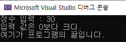


#### test_09.c : if else 문

```c
#include <stdio.h>

void main() {
	int nInput = 0;

	printf("숫자를 입력하세요:");
	scanf_s("%d", &nInput);

	if (nInput >= 10) {
		puts("10이상");
	}
	else {
		puts("10미만");
	}

}
```

> 출력 결과

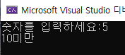


#### test_10.c : 조건 연산자 

> (조건) ? 참 : 거짓 ;

```c
#include <stdio.h>

void main() {
	int a, b;
	int min;

	//조건 연산자
	printf("두 정수를 입력하세요:");
	scanf_s("%d %d", &a, &b);
	min = (a < b) ? a:b ; // 조건식 ? 참:거짓;

	printf("작은 수는 :%d입니다\n", min);

}
```

> 출력 화면

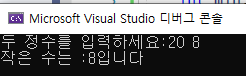


#### test_11.c : 조건의 범위 지정

> 20 <= bmi <25 가 안되는 이유 

1. 20 <= bmi 먼저 비교하여 참인 1 반환 
2.  그다음 1 < 25 를 비교하여 참 반환   

```c
#include<stdio.h>

void main() {
	double weight, height;
	double bmi;

	printf("몸무게를 입력하세요(kg):");
	scanf_s("%lf", &weight);
	printf("키를 입력하세요(cm) :");
	scanf_s("%lf", &height); 
	height = height / 100;
	bmi = weight / (height * height);
	printf("당신의 BMI는 %.1lf입니다.\n", bmi);
	if (bmi>=20.0 && bmi<25.0 ) {  
       // 20 <= bmi <25 가 안되는 이유 -> 프로그램 실행 순서 (위>아래, 좌우)
		printf("표준 체중입니다."); //20이상 25미만
	}
	else {
		printf("체중 관리가 필요합니다.");
	}
}
```

> 출력관리

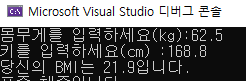


####  test_12.c  : 조건에 맞는 논리연산자 사용

> 아래 조건에 맞게 (?????) 빈칸을 작성하시오 

​	조건 1.  6세 이하의 어린이와 70세 이상의 어른들은 무료 입장.

​	조건 2.  그 외에는 3,000원의 입장료를 받는다. 

```c
#include <stdio.h>

void main() {
	// 6세 이하의 어린이와 70세 이상의 어른들은 무료 입장.
	// 그 외에는 3,000원의 입장료를 받는다. 
	int age; 
	printf("나이를 입력하세요.:");
	scanf_s("%d", &age);

	if ( ????? ) {
		printf("무료 입장입니다");
	} else {
		printf("입장료는 3,000원입니다.");
	}

}
```

> 출력화면 

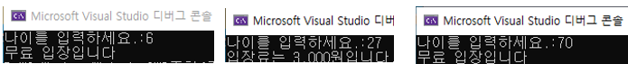

> 정답 

```c
#include <stdio.h>

void main() {
	// 6세 이하의 어린이와 70세 이상의 어른들은 무료 입장.
	// 그 외에는 3,000원의 입장료를 받는다. 
	int age; 
	printf("나이를 입력하세요.:");
	scanf_s("%d", &age);

	if (age <= 6 || age >= 70) {
		printf("무료 입장입니다");
	} else {
		printf("입장료는 3,000원입니다.");
	}

}
```

> 명심 포인트

1. 조건 모두 만족 시 참인 && AND 함수 사용 시 오류 
2. 조건 중 하나 만족 시 참인  || OR 함수를 사용 필요


#### test_13.c : 다중 IF 문 사용

> else if 사용 

``` c
#include<stdio.h>

void main() {
	double weight, height;
	double bmi;

	printf("몸무게를 입력하세요(kg):");
	scanf_s("%lf", &weight);
	printf("키를 입력하세요(cm) :");
	scanf_s("%lf", &height);
	height = height / 100;
	bmi = weight / (height * height);
	printf("당신의 BMI는 %.1lf입니다.\n", bmi);
	if (bmi >= 20.0 && bmi < 25.0) {  // 20 <= bmi <25 가 안되는 이유 -> 프로그램 실행 순서 (위>아래, 좌우)
		printf("표준 체중입니다."); //20이상 25미만
	} else if(bmi < 20) {
		printf("저체중 입니다.");
	}
	else {
		printf("과체중 입니다.");
	}
}
```

> 출력화면

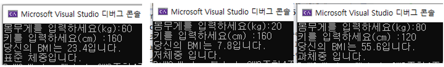


####  test_14.c : else 문 실행 순서

> else문은 거짓일 때만 실행한다. 

* 프로그램의 실행 순서는 <u>위에서 아래로</u> <u>순차적</u>으로 실행하는데 else는 조건이 거짓일 때만 실행한다.

* 숫자 75 입력 시 실행되는 문장 

  * **1번 -> 2번 -> 3번 -> 6번** 

  * why? 4번, 5번은 else 문으로 조건이 거짓일 때 실행한다. 

```c
#include <stdio.h>

void main() {

	int nInput = 0; 
	char chCredit = 'X';
	printf("숫자를 입력하시오. : ");
	scanf_s("%d", &nInput);

	if (nInput >= 90)  // 1번 
		chCredit = 'A';
	else if (nInput >= 80) // 2번  
		chCredit = 'B';
	else if (nInput >= 70) // 3번 
		chCredit = 'C';
	else if (nInput >= 60) // 4번  
		chCredit = 'D';
	else // 5번 
		chCredit = 'F';

	printf("Credit : %c", chCredit); // 6번 
}
```

> 실행결과

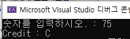


#### test_15.c  : switch() case 구문

> switch() case 구문 

* 여러 개 중에 하나 또는 둘 이상 선택 시  

* swithc(들어온 값이) 해당 case 값 일 때 실행  

> 사용 주의

* 2번 입력 시 

```c
#include<stdio.h>

void main() {
	int lot;

	printf("당첨 번호를 입력하세요 : ");
	scanf_s("%d", &lot);

	// switch() case 구문
	switch (lot) {
	case 1 : 
		printf("김서방");
	case 2 : 
		printf("홍가네");
	case 3 : 
		printf("안산댁");
	default : 
		printf("당첨자가 없습니다!");//그 외의 값
	}

}
```

* 문제 화면 

  홍가네만 나오는게 아니라 홍가네부터 마지막까지 모두 출력 됨

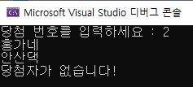

> break의 사용 : switch case 문을 빠져나간다. 

```c
#include<stdio.h>

void main() {
	int lot;

	printf("당첨 번호를 입력하세요 : ");
	scanf_s("%d", &lot);

	// switch() case 구문
	switch (lot) {
	case 1 : 
		printf("김서방\n");
		break; //switch case 문을 빠져나간다. 
	case 2 : 
		printf("홍가네\n");
		break;
	case 3 : 
		printf("안산댁\n");
		break;
	default : 
		printf("당첨자가 없습니다!\n");//그 외의 값
	}

}
```


#### test_16.c : switch() 문 응용

> 문자열 비교는 ' ' 작은 따옴표 사용. 대신 문자열  "  " 과 실수 1.1 은 case 값으로 못들어 감 

> 조건이  여러 개 일 경우  case 조건 : *  여러개 

```c
#include <stdio.h>

void main() {
	char sel;

	printf("M 오전, A 오후, E 저녁\n");
	printf("입력 : ");
	scanf_s("%c", &sel, 1);

	switch (sel) {
	case 'M':  // 두 가지 조건 사용 
	case 'm':
		printf("Morning\n");
		break;
	case 'A':
	case 'a':
		printf("Afternoon\n");
		break;
	case 'E':
	case 'e':
		printf("Evening\n");
		// break; 사용 해도 되고 안해도 됨
	}
}
```

> 출력 결과 	

* 대문자가 아닌 소문자로 a 를 입력한 경우

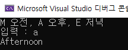

> 명심할 점 

* 문자열은 ' ' 작은 따옴표를 붙여야 한다.
  * 오류 : case M    / 정상 : case 'M'


#### test_17.c : Switch문을 활용하여 학점 부여하기 

> 90점 이상 A 학점 , 80점 이상 B학점, 70점 이상 C학점, 60점 이상 D학점, 그 외 C학점 계산 식 작성하시오

* Switch (입력받는 값) : 입력받는 값은 정수만 된다  ( 문자도 정수 )

* Tip : 나누기 10을 안쓰면 모든 Case에 조건을 부여해야 함

> 정답 

```c
#include <stdio.h>

void main() {
	int nInput = 0;
	char chCredit; 
	scanf_s("%d", &nInput);

	switch (nInput / 10) {  // 정수만 된다
	case 10 :
	case 9 : 
		chCredit = 'A'; 
		break;

	case 8: 
		chCredit = 'B';
		break;

	case 7:
		chCredit = 'C';
		break;

	case 6:
		chCredit = 'D';
		break;

	default : 
		chCredit = 'F';

	}

	printf("Credit : %c\n", chCredit);

}
```

> 출력 화면

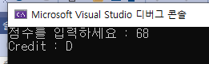

