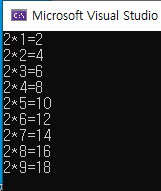

project5


#### test_01.c 반복문 - while() 문 : 비교 후 처리 

> while(조건) - 조건의 참/거짓 판별

```c
while (조건) { 	
		//참이면 실행
   		//거짓이면 {} 괄호 빠져나옴
	}
```

> 암기 ) nInput--  의미

*  nInput = nInput -1 

> 실습

```c
#include <stdio.h> 

void main() {
	// 반복문 (do~while , while, for) 
	int nInput = 0;
	scanf_s("%d", &nInput);

	while (nInput > 0) { //while(조건) : 참 , 거짓 
		printf("%dth printf()\n", nInput);
		nInput--; //nInput = nInput-1;

	}
}
```

> 출력결과


#### test_02.c while()문 + num++ 뜻

```c
#include <stdio.h> 

void main() {
	int num = 0;

	while (num < 5) {
		printf("Hello world! %d\n", num);
		num++; // num = num + 1; 

	}

}

```

> 출력화면


####  test_03.c  do while() : 선처리 후 비교

> do{      } while() 

```c
do {
	//선처리 
	} while (조건); // 후비교 
```

> 실습

* do 문장을 반드시 한 번은 실행

55 -> 110 -> 165 -> 210 -> 265(통과) -> (실행)310(중단) 

```c
#include <stdio.h>

void main() {
	int height = 0;
	int days = 0; 

	do {
		height = height + 55;
		days = days + 1; 
	} while (height < 300);

	printf("달팽이가 우물을 올라가는 데 걸린 일 수 : %d\n ", days);
}
```

> 출력 결과


#### test_04.c 

```c
#include <stdio.h>

void main() {
	int i = 1; 

	while (i <= 9) {
		printf("2*%d=%d\n", i, 2 * i);
		i = i + 1; //i++ 
	}
}
```

> 출력결과




#### test_05.c

> 문제

* 양수를 반복적으로 입력받으면서 그합을 출력. 이광정에서 음수가 입력될 떄 까지 반복. 
* 처음부터 음수면 바로 종료 

```c
#include <stido.h>

void main() {
	int n = 0; 
	int sum = 0;

	printf("양수를 입력하세요:");
	scanf_s("%d", &n);

	while (n >= 0) {
	    //1
		printf("지금까지 입력된 값의 합 : %d\n", sum);
		printf("양수를 입력하세요:");
        //2
	}

}
```


> 답

```c
#include <stdio.h>

void main() {
	int n = 0; 
	int sum = 0;

	printf("양수를 입력하세요:");
	scanf_s("%d", &n);

	while (n >= 0) {
		sum = sum + n; //1번
		printf("지금까지 입력된 값의 합 : %d\n", sum);
		printf("양수를 입력하세요:");
		scanf_s("%d", &n); //2번
	}

}
```

> 출력화면


#### test_06.c while() 문과 if문의 활용

> 문제 : 1부터 100까지의 홀수의 합 

* 조건 : 나머지 연산 활용

> 정답

```c
#include <stdio.h>

void main() {
	int i = 0;
	int sum = 0;

	i = 1;
	while (i <= 100) {
		if (i % 2 == 1) // ( i % 2 !=0 ) 짝수와 홀수 체크 
			sum = sum + i; //참 일 때 실행 
		i++; // i = i + 1;
	}
	printf("1부터 100까지의 홀수의 합은 %d", sum);

}
```

> 명심포인트

1. 짝수와 홀수 구분은 if 문을 사용
2. if()문은 첫번째 문장은 반드시 실행

> 출력결과


#### test_07.c 실습

> 문제 . 구구단 중 한개의 단을 입력 받아서 그 단을 출력하는 프로그램 작성(while문 사용)


> 정답 

```c
#include <stdio.h>

void main() {
	int gugudan;
	int i=0;
	printf("한 개의 단을 입력하세요. : ");
	scanf_s("%d", &gugudan);

	while (i <= 9) {
		printf("%d * %d = %d\n", gugudan, i, gugudan*i);
		i++;
	}

}
```

> 명심포인트

1. 단수를 입력 받을 수 있는 변수를 만들어 줘야 한다.
2. i++ 를 사용 안하면 무한 반복된다. 


#### test_8.c 중첩 while문 (while 문 안에 while 문이 들어있다)

##### 반복문 안에 반복문이 들어있다. 

> 이해하기!!  

1. while(y<5) -> while(x<4) { } 5번 반복

2. while(x<4){ } -> {   } 괄호를 4번 반복  
3. 따라서 20번의 반복문은 {  괄호 } 안에 들어가야 함 


> 생각하기.  해당 코드의 별표가 5줄이 아닌 한줄만 나온 이 유


```c
#include<stdio.h>

void main() {
	int x = 0;
	int y = 0;

	while (y < 5) { //0,1,2,3,4 -> 총 다섯 번 while(x<4)문 반복 
		while (x < 4) { //0,1,2,3 -> 총 4 번 {괄호} 내용 반복
			printf("*\t");   // \t 는 탭 -> *   *   *   * 
 			x++;
		}
		printf("\n"); 

		y++;
	}

}
```

> 정답 

1. 한 줄이 아니라 공백으로 4줄이 나온 거 였음 
   * y = 0 일 때 x 를 0,1,2,3를 실행한 상태에서 y=1를 실행할 때 x 값은 4라서 실행 안함 


```c
 #include<stdio.h>

void main() {
	int x = 0;
	int y = 0;

	while (y < 5) { //0,1,2,3,4 -> 총 다섯 번 while(x<4)문 반복 
		
		while (x < 4) { //0,1,2,3 -> 총 4 번 {괄호} 내용 반복
			printf("*\t");   // \t 는 탭 -> *   *   *   * 
 			x++;
		}
		printf("\n"); 

		y++;
		x = 0;
	}

}
```


> 출력화면 


