### project5


#### test_09.c 증감연산자

> printf("%d\n", **++nData**) 와 printf("%d\n", **nData++**) 의 차이 

- printf("%d\n", **++**nData);  :  ++가 앞에 있으면 nData를 **무조건 증가 시킨** 후에 출력 
- printf("%d\n", nData**++**);  : ++ 뒤에 있으면 nData 출력시킨 후 **'나중에 증가'**

```c
#include <stdio.h>

void main() {
	int nData = 10;
		
	//증감 연산자
	nData--; // nData=nData-1;
	--nData;
	nData++;
	++nData;

	printf("%d\n", nData); // 10
	printf("%d\n", ++nData); // 11 앞에 있으면 '먼저 증가' 시키고 출력 
	printf("%d\n", nData++); // 11 뒤에 있으면 출력하고 '나중에 증가'
	rintf("%d\n", nData); // 12

}
```

> 출력화면

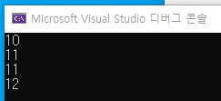


 

####  test_10.c  증감연산자 확실히 이해하기

> 아래 출력화면 예상하기 

```c
#include <stdio.h>

void main() {
	int a = 0;
	int b = 0;

++a;
b++;

printf("a=%d, b=%d\n", a, b); 
b = a++;  
printf("a=%d, b=%d\n", a, b);  
b = ++a;
printf("a=%d, b=%d\n", a, b); 

printf("a=%d, b=%d\n", a++, b++);
printf("a=%d, b=%d\n", a, b);  
```

> 출력화면 

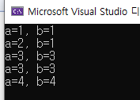

```c
#include <stdio.h>

void main() {
	int a = 0;
	int b = 0;

	++a;
	b++;

	printf("a=%d, b=%d\n", a, b);  // 1  1 
	b = a++;  // b에 a을 넣고 a를 증가 
	printf("a=%d, b=%d\n", a, b);  // 2  1  
	b = ++a; // a를 무조건 증가하고 b에 넣음 
	printf("a=%d, b=%d\n", a, b);  // 3 3 

	printf("a=%d, b=%d\n", a++, b++); // 3  3  a, b 둘다 출력시킨 후 나중에 증가 
	printf("a=%d, b=%d\n", a, b);  // 4 4 

}
```

>  명심포인트 

1. b = a++;   printf("a=%d, b=%d\n", a, b); 
2. b = ++a;   printf("a=%d, b=%d\n", a, b);


#### test_11.c  nResult = ++nData + nNewData++  이해하기

```c
#include <stdio.h>

void main() {
	int nData = 10; 
	int nNewData = 20;
	int nResult = 0;

	printf("%d\n", ++nData); //11  
	printf("%d\n", nData++); // 11 (nData : 12상태)

	nResult = ++nData + nNewData++;   //13 + 20 (nNewData : 21상태)

	printf("%d\n", nResult); //33
	printf("%d\n", nNewData); // 21
}

```

> 출력화면

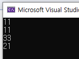


#### test_12.c while문과 증감연산자의 사용 예

> 문제1. 키보드로 부터 양수를 입력받으면 그 숫자만큼 별(*)이 출력되는 프로그램을 작성하시오. 
>
> while 문과 증감연산자를 사용하시오.

​                           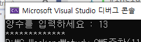

> 내가 입력한 답

```c
#include <stdio.h>

void main() {
	int nData;

	printf("양수를 입력하세요 : ");
	scanf_s("%d", &nData);  // 3

	while (nData != 0) {
		printf("*");
		--nData;
	}
}
```

> 답 작성 이유

1. nData가 0이 아닐때까지 *를 출력하고 출력하면 nData값을 1 줄여준다

 

> 학원 정답 - 질문하기 

```c
#include <stdio.h>

void main() {
	int n;
	int i = 0;

	printf("양수를 입력하세요 : ");
	scanf_s("%d", &n); 

	while (i<n) {

		printf("*");
		i++; // 단독으로 사용하면 ++i;으로 사용해도 되는지

	}
}
```


> 문제2. 추가로 한 줄에 5개씩 추력되도록 바꾸어 보시오

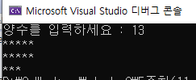

> 내가 입력한 답 

```c
#include <stdio.h>

void main() {
	int nData;
	int i=0;

	printf("양수를 입력하세요 : ");
	scanf_s("%d", &nData);  // 6

	while (nData != 0) {			
		    printf("*");
			i++;

			if (i == 5) {
				printf("\n");
				i = 0;
			}
			--nData;
	}
}
```

> 답 작성 이유 

1. ndata가 0이 아닐 때까지 *를 출력하고 *출력하면 ndata 값을 1씩 줄이기
2. 5개씩 잘라야 하기 때문에 5를 구분할 수 있는 i 변수를 만들고 *가 출력되면 i 값을 하나씩 늘려 i가 5가 될 때 줄바꿈을 하고 i를 다시 0으로 초기화 시켜 반복

> 추가 공부하기 

증감연산자를 앞에 쓸지 옆에 쓸지 확실히 이해하기


> 학원정답 

```c
#include <stdio.h>

void main() {
	int n;
	int i = 0;

	printf("양수를 입력하세요 : ");
	scanf_s("%d", &n); 

	while (i<n) {
		printf("*");
		i++;
        
		if (i % 5 == 0) 
			printf("\n"); //if문은 첫번째 ; 문장 실행
	}
}
```


####  test_13.c for문 - 공부하기 : for문 실행 순서

> for(변수 초기화; 비교 ; 증가 )  + 반복할 명령문 조합  

- ; 세미콜론 의미 - '끝' 

> i++ 은 단독으로 있으면 앞 뒤를 안따짐. 따라서, ++i도 가능 

- 단독 구분은 ; 세미콜론으로 확인 

```c
#include <stdio.h>

void main() {
	int i;

	for (i = 0; i < 5; i++) { //(초기화; 비교 ; 증가)
		printf("%dth\n", i);
	} 

}
```


#### test_14.c for문의 변수 선언 중요성 

> int sum = 0; 변수 선언 주의 

* int sum : c언어는 변수선언을 하고 값을 안주면 쓰레기 값이 들어감

* sum = sum + 1 : 실행시 오류 

```c
#include <stdio.h>

void main() {
	int i;
	int sum = 0; //주의

	for (i = 1; i <= 10; i++) {
		sum = sum + i;
	}
	printf("1부터 10까지의 합은 : %d\n", sum);

}
```

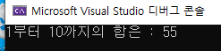

#### test_15.c for문 문제 

> 문제. 키보드로 받은 숫자 만큼 누적된 합을 구하시오

```c
#include <stdio.h>

void main() {
	int total = 0;
	int i;
	int num;

	printf("0부터 num까지의 덧셈, num은?");
	//키보드로 받은 숫자까지 누적된 합을 구하시오

	printf("0부터 %d까지 덧셈결과:%d\n", num, total);
}
```

> ★0입력시 답이 0이 되는건 for문 순서와 관련있으니 다시 공부하기 

> 출력화면 


> 정답 

```c
#include <stdio.h>

void main() {
	int total = 0;
	int i;
	int num;

	printf("0부터 num까지의 덧셈, num은?");
	
	scanf_s("%d", &num);
	for (i = 0; i < num + 1; i++) { //i <= num;
		total = total + i;
	}


	printf("0부터 %d까지 덧셈결과 : %d\n", num, total);
}
```


#### test_16.c

> 문제, 키보드로부터 다섯 명의 나이를 입력 받아서 평균 나이를 출력하는 프로그램을 for문을 사용하여 작성하시오. 소수점 이하 첫째 자리까지 출력하시오. 

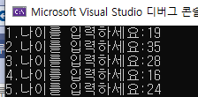


> 내가 쓴 정답 

```c
#include <stdio.h>

void main() {
	int age; 
	int i;
	int sum=0;
	float avg;
	
	for (i = 1; i < 6; i++) {
		printf("%d.나이를 입력하세요:", i);
		scanf_s("%d", &age);
		sum = sum + age;
		
	}

	avg = (float)sum / 5;
	printf("다섯명의 평균 나이는 %.1lf입니다.", avg);


}

```

> 학원 정답 

```c
#include <stdio.h>

void main() {
	int total = 0;
	int i;
	int num;

	printf("0부터 num까지의 덧셈, num은?");
	
	scanf_s("%d", &num);
	for (i = 0; i < num + 1; i++) { //i <= num;
		total = total + i;
	}

	printf("0부터 %d까지 덧셈결과 : %d\n", num, total);
}
```


#### test_17

> 문제. 구구단  7단을 출력하는 프로그램을 작성하시오.
>
> 단, for문을 사용하여 한 줄에 세개씩 출력하시오. 

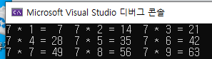

> 내가 작성한 정답

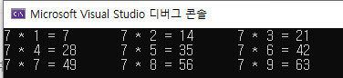

```c
#include <stdio.h>

void main() {
	int i;
	int dan = 7;
	for (i = 1; i <= 9; i++) {
		printf("%d * %d = %d\t", dan, i, dan * i);
		if (i % 3 == 0) {
			printf("\n"); 		
		}
	}

}
```


> 학원 답 - %2d 의 뜻 다시 확인하기 2주차-코드  test17참고 


```c
#include <stdio.h>

void main() {
	int i;

	for (i = 1; i <= 9; i++) {
		printf("7 * %d = %2d", i, 7 * i);
		if (i % 3 == 0) {
			printf("\n"); 		
		}
	}

}
```


> 명심포인트 

1. 제어변수 역할을 하는 i 이요  (제어변수 :  증가하면서 반복)
2. ★★★★ %2d 로 출력하여 간격을 맞춰준다 %(숫자)d 


while은 if + 반복문

#### test_18.c : 반복문 while 안에 반복문 for

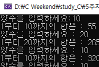

> 위의 출력화면 문제를 해결하시오 (값이 더해짐)

```c
#include <stdio.h>

void main() {
	int n;
	int i;
	int sum=0;

	printf("양수를 입력하세요:");
	scanf_s("%d", &n);

	while (n > 0) {
		for (i = 1; i <= n; i++) {
			sum += i; //sum = sum + i ;
		}
		
		printf("1부터 %d까지의 합은 : %d\n", n, sum);
		printf("양수를 입력하세요 : "); 
		scanf_s("%d", &n);
		
	}

}
```

> 정답 - ★ sum 변수를 0으로 초기화 시켜줘야 함

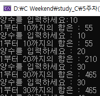

```c
#include <stdio.h>

void main() {
	int n;
	int i;
	int sum=0;

	printf("양수를 입력하세요:");
	scanf_s("%d", &n);

	while (n > 0) {
		for (i = 1; i <= n; i++) {
			sum += i; //sum = sum + i ;
		}
		
		printf("1부터 %d까지의 합은 : %d\n", n, sum);
		printf("양수를 입력하세요 : "); 
		scanf_s("%d", &n);
		sum = 0;
		
	}

}
```


#### test_19.c 다중 FOR문을 이용한 5행 4열 별표 출력하기

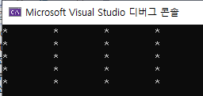

> 정답 

```c
#include <stdio.h>

void main() {
	int x;
	int y;

	for (y = 0; y < 5; y++) {
		x = 0;
		for (x = 0; x < 4 ; x++) {
			printf("*\t");
		}
		printf("\n");
	}

}
```


#### test_20.c 다중 FOR문을 이용한 행만큼 열도 증가하는 별표 출력하기

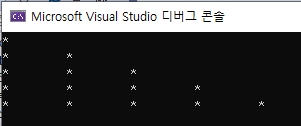

```c
#include <stdio.h>

void main() {
	int x;
	int y;

	for (y = 0; y < 5; y++) {
		for (x = 0; x < y + 1; x++) {
			printf("*\t");
		}
		printf("\n");
	}
}
```

> 명심포인트

1.  x < y+1 또는 x<=y 적기 


#### test_21.c 반대로 출력하기 행이 증가하면 열 감소하는 별표 출력 (이해하기!!!)

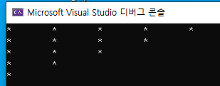

```c
#include <stdio.h>

void main() {
	int x;
	int y;

	for (y = 0; y < 5; y++) {
		for (x = 0; x < 5-y; x++) {
			printf("*\t");
		}
		
		printf("\n");
	}

}
```

> 명심포인트 

1.  x < 5-y 를 생각할 줄 알아야 함 

행이 늘면 별표가 그 행 수만큼 줄어들어야 함 
