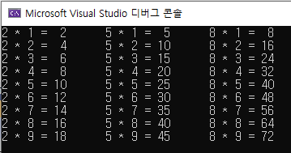
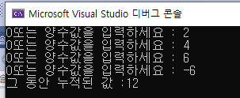
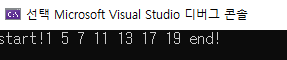
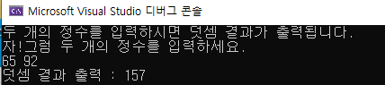
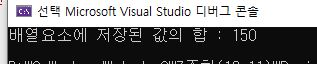
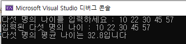

# project 7

#### test_22.c 이중 FOR 문 활용 

> 문제. 아래 화면이 출력되도록 입력하시오

 

```c
#include <stdio.h>

void main() {
	int i;
	int j;

	//바깥 for 작동은 안쪽 for 작동이 모두 완료했을 때 
	for (i = 1; i <= 9; i++) {
		for () {

		}
	}

}
```

> 정답 

* 나 

```c
#include <stdio.h>

void main() {
	int i;
	int j;

	//바깥 for 작동은 안쪽 for 작동이 모두 완료했을 때 
	for (i = 1; i <= 9; i++) {
		for (j = 2; j <= 8;j++) {
			printf("%d * %d = %2d\t", j, i, j * i);
			j = j + 2;
		}
		printf("\n");
		j = 0;
	}

}
```

```c
#include <stdio.h>


void main() {
	int i;
	int j;

	//바깥 for 작동은 안쪽 for 작동이 모두 완료했을 때 
	for (i = 1; i <= 9; i++) {
		for (j = 2; j <= 8;j+=3) {
			printf("%d * %d = %2d\t", j, i, j * i);
		}
		printf("\n");
		
	}

}
```


> 명심포인트 

1. 간격 맞추기 
2. j가 3씩 증가 식의 표현 : j+=3


### test_23.c 무한반복 while 문과 break, sum 초기화 누적 변수는 초기화 필수

```c
#include <stdio.h>


void main() {
	int sum=0; 
	int n=0;

	while (1) { //무한반복 
 		
		printf("0또는 양수값을 입력하세요 : ");
		scanf_s("%d", &n);
		// sum = sum + n;
		if (n < 0)
			break; //입력된 값이 음수이면 반복문을 빠져나간다.
		sum += n;
		
	}
	printf("그 동안 누적된 값 :%d\n", sum);

}
```


> 출력화면



> 명심포인트! 

* sum = 0 으로 초기화 하지 않으면 안되는 이유 

  sum +=n; 을 풀어쓰면 sum = sum + n;

  <u>sum 변수 선언 후 초기화 하지 않으면 쓰레기 값이 들어 있음</u>

  반면 n은 scanf_s() 함수로 입력값을 받음 

  따라서, 누적되는 값인 sum은 반드시 초기화 시켜야 한다. 

* break; 는 반복문을 벗어나게 하는 명령문


### test_24.c continue; 사용 

> 아래 화면이 출력하시오. 2와 3의 배수를 제외하여 출력 



> 방법 1. 

```c
#include <stdio.h>


void main() {
	int num;
	printf("start!");
	for (num = 0; num < 20; num++) {
		
			if (num % 2 != 0 && num % 3 != 0) {
			printf("%d ", num);
			} 
			
	}
	printf("end!\n");
}

```

> 방법 2. (다시 이해하기)  continue 사용 

```c
#include <stdio.h>


void main() {
	int num;
	printf("start!");
	for (num = 0; num < 20; num++) {
		
		if (num % 2 == 0 || num % 3 == 0) 
			continue; // if조건을 만족하면 for문을 다시 실행하러 가라 
			printf("%d ", num);	
	}
	printf("end!\n");

}

```


### test_01.c 함수 (매우중요!)

> 함수란? 특별한 (기능)을 수행하는 코드 

> 함수 작성 규칙 및 작동원리 ★

```c
int add(int num1, int num2) {
    return num1 + num2;
}
void main() {
    add(3,4);
}
```

1. 함수의 기능에 맞는 이름을 정한다.  (add / main)

2. 매개변수는 옵션이다. (int num1, int num2) 

   * 매개변수는 외부로부터 값을 전달 받는다.

3. 리턴값의 형태를 적어준다. (int / void) ※ void 란 반환값이 없음을 표시한다. 

   * return 값이 **있을** 경우에는 **값을 (함수를 호출한 곳으로)반환하고 종료**

   * return 값이 **없을** 경우에는 **함수 종료**를 의미 

     → 중요★!! 종료 시 메모리에서 사라지고 호출할 때 만들어진다. 

   * void main() 인 경우 void가 반환값이 없기 때문에 return 0 ;을 안썼지만
     int main() 은 return 0; 을 꼭 써주기 (안써도 문제 없지만 써주기!!) 

   ```c
   int main() {
       return 0; 
   }
   ```

4. 함수는 ( ) 가 존재한다. 

5. { }  몸체 

6. 함수는 호출되기 **전에 정의**되어 있어야하고, **호출되면 작동한다.!!★** add(3,4)

   →  호출 될 때 메모리에서 만들어짐 

   * 정의

   ```c
   //정의
   int add(int num1, int num2) {
       return num1 + num2;
   }
   ```

   * 호출

   ```c
   void main() {
       add(3,4);
   }
   ```

7. 다른 함수가 먼저 있어도 프로그램은 **항상** **main( ) 함수부터 시작!!된다.★**

```c
#include <stdio.h>

//함수란?특별한 (기능)을 수행하는 코드 
int add(int num1, int num2) {
	return num1 + num2; //7반환하고 종료
	// return 값이 있을 경우에는 값을 (함수를 호출한 곳으로)반환하고 종료
	// return 값이 없을 경우에는 함수 종료를 의미
	// 매개변수는 외부로부터 값을 전달 받는다. 
}

int main() {
//int main() 에서 int란 반환값이 정수형이라는 것을 의미한다.
	int result; 
	result = add(3,4); //7 저장 
	printf("덧셈 결과 1 : %d\n", result); // 7
	result = add(5, 8); // 13 덮어써서 새로운 값을 저장 
	printf("덧셈 결과 2 : %d\n", result); // 13

	return 0; //내가 호출하는게 아니라 윈도우가 호출하는 것 
	// void main() 인 경우 void가 반환값이 없기 때문에 return 0 ;을 안써줬지만 
	// int main() 은 return 0; 을 꼭 써주기 (안써도 문제 없지만 써주기!!) 
}
//1. 함수의 기능에 맞는 이름을 정한다.  (add / main)
//2. 매개변수는 옵션이다.
//3. 리턴값의 형태를 적어준다. (void) ※ void 란 반환값이 없음을 표시한다. 
//4. 함수는 ( ) 가 존재한다. 
//5. { }  몸체 
//6. 함수는 호출되기 전에 정의되어 있어야하고, 호출되면 작동한다.!!

```

### test_02.c 함수는 하나의 독립된 공간 

> 함수는 하나의 독립된 공간이다. 

* 메모리에서 별도에서 만들어진 공간을 사용 
* 도시로 하면 서울과 부산, 각 도시에 이름이 같은 사람이 있어도 되는 것처럼 각 함수에 같은 이름 존재 가능 
* 그러나 한 함수에 같은 이름이 있으면 에러 

> 지역변수

* 함수 안에서 선언된 변수를 지역변수라 하고 함수 안에서만 사용 가능하고 함수 종료 시 사라짐 

* why? 함수는 return 값을 (함수를 호출한 곳으로)반환하고 종료 후 메모리에서 사라지기 때문에 지역변수도  함수 종료 시 사라짐 

> 프로그램 실행 순서 

* 내가 코딩한 순서대로 컴파일 됨 

* main() 함수 먼저 체크 → add() 호출 

```c
#include <stdio.h>
//함수는 하나의 독립된 공간이다. (메모리에서 별도로 만들어진 공간) 
//도시로 하면 서울과 부산, 각 도시에 이름이 같은 사람이 있음 
//한 도시에서 같은 이름이 있으면 에러 
int add(int nA, int nB) {
	int nResult = 0; // 함수 안에서 선언된 변수를 지역변수라 하고 
	//함수 안에서만 사용 가능하고 함수 종료 시 사라짐 
	//int nResult = 0; 가 추가로 있을 경우 에러
	nResult = nA + nB;
	printf("%d\n", nResult);
	return nResult;
}

int main() {
	int nResult = 0;
	nResult = add(3, 4) + 10;
	printf("%d\n", nResult);
    
	return 0;
}
```


### test_03.c (문제) 함수의 작동원리 파악 

>  아래 (1) (2) 빈칸에 들어 갈 값을 적으시오.

```c
#include <stdio.h>

int total(int kor, int eng, int mat) {
	int tot;
	tot = kor + eng + mat;
	return tot;

}

double average(int tot) {
	double avg;
	avg = tot / 3.0;
	return avg;

}

int main() {
	int kor, eng, mat;
	int tot;
	double avg;
	
	printf("세 과목의 점수를 입력하세요 : ");
	scanf_s("%d%d%d", &kor, &eng, &mat);
	// ( 1 ) 
	// ( 2 ) 
	printf("총점:%d,평균:%.1lf\n", tot, avg);


	return 0;
}
```

> 정답

```c
#include <stdio.h>

int total(int kor, int eng, int mat) {
	int tot;
	tot = kor + eng + mat;
	return tot;

}

double average(int tot) {
	double avg;
	avg = tot / 3.0;
	return avg;

}

int main() {
	int kor, eng, mat;
	int tot;
	double avg;
	
	printf("세 과목의 점수를 입력하세요 : ");
	scanf_s("%d%d%d", &kor, &eng, &mat);
	tot = total(kor, eng, mat);
	avg = average(tot);
	printf("총점:%d,평균:%.1lf\n", tot, avg);


	return 0;
}
```

> 명심포인트 

1. 함수는 호출 후 메모리에서 사라지기 때문에 변수에 저장해둔다. 
2. 저장해야지 출력 가능


###  test_04.c 함수의 종류 

> 아래 빈칸을 채우세요

```c
#include <stdio.h>

int Add(int num1, int num2) {
	return num1 + num2;


}

void ShowAddResult(int num) {
	// 반환값이 없는 함수 
	// 외부로 붙더 받아서 결과물을 보여주는 함수 

	printf("덧셈 결과 출력 : %d\n", num);

}

int ReadNum(void) {
	//매개 변수 없는 함수 (외부로 받는 경우가 없음) 
	//입력 받을 때 사용 
	int num;
	scanf_s("%d", &num);
	return num;

}

void HowToUseThisProg(void) {
	printf("두 개의 정수를 입력하시면 덧셈 결과가 출력됩니다.\n");
	printf("자!그럼 두 개의 정수를 입력하세요.\n");
}

int main() {
	 /* 
	  함수 호출하기 
	 
	 */

	return 0;
}
```


> 정답 

```c
#include <stdio.h>

int Add(int num1, int num2) {
	return num1 + num2;


}

void ShowAddResult(int num) {
	// 반환값이 없는 함수 
	// 외부로 붙더 받아서 결과물을 보여주는 함수 

	printf("덧셈 결과 출력 : %d\n", num);

}

int ReadNum(void) {
	//매개 변수 없는 함수 (외부로 받는 경우가 없음) 
	//입력 받을 때 사용 
	int num;
	scanf_s("%d", &num);
	return num;

}

void HowToUseThisProg(void) {
	printf("두 개의 정수를 입력하시면 덧셈 결과가 출력됩니다.\n");
	printf("자!그럼 두 개의 정수를 입력하세요.\n");
}

int main() {
	int result, num1, num2;

	HowToUseThisProg();
	num1 = ReadNum();
	num2 = ReadNum();
	result = Add(num1, num2);
	ShowAddResult(result);

	return 0;
}
```

> 출력화면




### test_05.c 배열

> 배열

* 동일타입 변수 선언 시 배열 사용이 효율적 

* 배열은 여러 개의 값을 처리할 때 사용 

* 배열은 저장공간이 메모리에 분산되어 있지 않고 연속적으로 **나열**되어 있다.

* 인덱스는 배열의 위치를 나타냄, 0부터 시작 

예) 집 : 배열명, 호수 : 인덱스 

```c
#include <stdio.h>

int main() {
	int arr[5]; //4byte크기 배열 변수 선언 
	int sum = 0, i;
	
    //배열 선언 방법 1
	arr[0] = 10, arr[1] = 20, arr[2] = 30, arr[3] = 40, arr[4] = 50;

	for (i = 0; i < 5; i++) {
		sum += arr[i]; // sum = sum + arr[i];
	}

	printf("배열요소에 저장된 값의 합 : %d\n", sum);

	return 0;

}
```

> 출력결과 




### test_06.c 배열 선언 및 출력 

```c
#include <stdio.h>

int main() {
     //배열 선언 방법 2
	int nData[4] = { 1,2,3,4 };
	int i; 

	for (i = 0; i < 4; i++) {
		printf("%d\n", nData[i]);
	}

	return 0;
} 
```


### test_07.c (문제)

> 문제. 아래 주석에 알맞은 내용 작성 

``` c
#include <stdio.h>

int main() {
	int ages[5];
	// 변수 선언
	double avg;
	int i;
	printf("다섯 명의 나이를 입력하세요 : ");

	for () {
		// 각 배열요소에 나이 입력
	}
	for () {
		// 모든 배열 요소의 값을 누적 
	}

	avg = tot / 5.0; // 평균나이 계산 
	printf("입력된 다섯 명의 나이 : ");
	for (i = 0; i < 5; i++) {
		// 배열에 저장된 값 출력 
 	}
	printf("\n다섯 명의 평균 나이는 %.llf입니다\n", avg);

	return 0;
}
```


> 정답 

```c
#include <stdio.h>

int main() {
	int ages[5];
	int tot=0;
	double avg;
	int i;
	printf("다섯 명의 나이를 입력하세요 : ");

	for (i = 0; i < 5; i++) {
		// 각 배열요소에 나이 입력
		scanf_s("%d", &ages[i]); //%d 뒤에 공백 주의 → 공백 입력 시 제대로 출력 안됨
	}

	for (i = 0; i < 5; i++) {
		// 모든 배열 요소의 값을 누적 
		tot += ages[i];
	}

	avg = tot / 5.0; // 평균나이 계산 
	printf("입력된 다섯 명의 나이 : ");
	for (i = 0; i < 5; i++) {
		// 배열에 저장된 값 출력 
		printf("%d ", ages[i]);
 	}
	printf("\n다섯 명의 평균 나이는 %.1lf입니다\n", avg);

	return 0;
}
```

> 출력화면



> 명심 포인트 !! 

* scanf_s("%d", &ages[i]); 에 %d에 공백을 붙여서 scanf_s("%d ", &ages[i]); 으로 쓸 경우 오류남 


### test_08.c (문제) 가장 큰 값 찾기

> 가장 큰 값을 찾을 수 있도록 아래 주석을 채우시오.


```c
#include <stdio.h>

//다섯 개의 숫자중 가장 큰수 찾기 
int main() {

	double nums[5];
	double max;
	int i;

	printf("다섯 개의 숫자를 입력하세요. : ");

	for () {
		 // 입력 
	}

	//기준 

	for () {
		//입력 
	}

	printf("가장 큰 값은 : %.1lf입니다.",max);

	return 0;
}
```

> 정답 

```c
#include <stdio.h>

//다섯 개의 숫자중 가장 큰수 찾기 
int main() {

	double nums[5];
	double max;
	int i;

	printf("다섯 개의 숫자를 입력하세요. : ");

	for (i = 0; i < 5; i++) {
		scanf_s("%lf", &nums[i]);
	}

	max = nums[0]; //기준 

	for (i = 0; i < 5; i++) {
		if (max < nums[i]) 
			max = nums[i];	
	}

	printf("가장 큰 값은 : %.1lf입니다.",max);

	return 0;
}
```

질문!! 하기!!

1. int main() 도 return 0; 시 메모리에서 사라지는 지

2. void main()아니고 int main() 을 쓰는지 

3. continue

4. scanf_s("%d", &ages[i]);  공백 시 오류 나는 이유 

   

