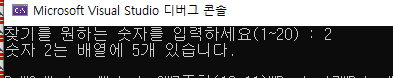

## Project8 


### test_10.c 배열의 개수 구하기

> 출력화면 



> 문제 : 빈칸 채우시오.

```c
#include <stdio.h>

int main() {

	int ary[] = { 2,8,15,1,8,10,5,19,19,3,5,6,6,2,8,2,12,16,3,8,17,12,5,3,14,3,2,17,19,16,8,7,12,19,10,13,8,20,16,15,4,12,3,14,14,5,2,12,14,9,8,5,3,18,18,20,4 };

	int i;
	int size;
	int n;
	int count = 0;

	printf("찾기를 원하는 숫자를 입력하세요(1~20) : ");
	scanf_s("%d", &n);

	// ( 1 ) 
	for (i = 0; i < //(2)   ; i++) {
		if (ary[i] == n)
			count++;
	}
	printf("숫자 %d는 배열에 %d개 있습니다.\n", n, count);

	return 0;

}
```

>  size = sizeof(ary) / sizeof(ary[0]); 

* 배열에 들어가 있는 정수 개수  =  배열 전체 크기 /  ary[0]에 들어가 있는 2의 크기 4byte 

> 정답 

```c
#include <stdio.h>

int main() {

	int ary[] = { 2,8,15,1,8,10,5,19,19,3,5,6,6,2,8,2,12,16,3,8,17,12,5,3,14,3,2,17,19,16,8,7,12,19,10,13,8,20,16,15,4,12,3,14,14,5,2,12,14,9,8,5,3,18,18,20,4 };

	int i;
	int size;
	int n;
	int count = 0;

	printf("찾기를 원하는 숫자를 입력하세요(1~20) : ");
	scanf_s("%d", &n);

	size = sizeof(ary) / sizeof(ary[0]); // ary[0]에 들어가 있는 2의 크기 4byte

	for (i = 0; i < size ; i++) {
		if (ary[i] == n)
			count++;
	}
	printf("숫자 %d는 배열에 %d개 있습니다.\n", n, count);

	return 0;

}
```


### test_11

> 출력화면 

* 아래의 화면처럼 나온 이유 


> 코드 

```c
#include <stdio.h>

int main() {
	char word[50];
	word[0] = 'L';
	word[1] = 'o';
	word[2] = 'v';
	word[3] = 'e';

	printf("%s", word);
}
```


> 문자 배열의 마지막에 널문자('\0')가 없으면 저장된 문자열의 끝을 알 수 없다. 

world[50] = [L|o|v|e|---------] : 4개(Love) | 나머지 46개 (초기값 = 쓰레기값)

* 문자가 모인걸 문자열(String)
* word배열명을 %s로 찍어서 출력됨 (나머지 46개도 포함하여)

> Love만 출력되게 끔 하고 싶으면 ? 

* 문자열의 끝을 알 수 있게끔 word[4] = '\0'; 을 추가해준다.

> 배열의 데이터 끝을 알려주는 널문자 ('\0')

```c
#include <stdio.h>

int main() {
	char word[50];
	word[0] = 'L';
	word[1] = 'o';
	word[2] = 'v';
	word[3] = 'e';
	word[4] = '\0';

	printf("%s", word);
	// 문자 배열의 마지막에 널문자('\0')가 없으면 저장된 문자열의 끝을 
	// 알 수 없다. 


}

```

> 출력화면


###  test_12 while문을 사용하여 입력 글자수 세기

> scanf함수는 문자열 입력 받으면 널문자 자동으로 채워준다.


> 실습 

```c
#include <stdio.h>

int main() {
	char word[80];
	int i;

	printf("단어를 입력하세요. : ");
	scanf_s("%s", word ,80);

	//scanf함수는 문자열 입력 받으면 널문자 자동으로 채워준다.
	i = 0;

	while (word[i] != '\0') {
		i++;

	}

	printf("%s 단어의 길이는 %d자입니다.",word, i);

	return 0;
}
```

> 출력화면


### test_13.c 

> c언어의 문자, 문자열 저장공간 타입은 char이다.

* Java의 경우 : 문자 저장은 char , 문자열 저장은 string 

> 문자열 출력은 %s 

```c
#include <stdio.h>

int main() {

	char str[50] = "I like C programming";
	printf("string:%s\n", str);


}

```


> 아래 출력화면이 나오는 이유는? 


```
#include <stdio.h>

int main() {

	char str[50] = "I like C programming";
	printf("string:%s\n", str);

	str[8] = '\0'; // 8번째 공백 자리에 널문자 값을 입력 

	printf("string:%s\n", str); 

}
```

* 널문자가 문자의 끝을 알려주기 때문에 string:I like C 까지만 출력


> 널문자('\0') 는 문자열의 끝을 알려준다. 

```c
#include <stdio.h>

int main() {

	char str[50] = "I like C programming";
	printf("string:%s\n", str);

	str[8] = '\0'; // 8번째 공백 자리에 널문자 값을 입력 

	printf("string:%s\n", str); 

	str[6] = '\0'; // 8번째 공백 자리에 널문자 값을 입력 

	printf("string:%s\n", str);

	str[1] = '\0'; // 8번째 공백 자리에 널문자 값을 입력 

	printf("string:%s\n", str);

	return 0;

}

```

> 출력화면 


### test_15.c  배열의 나머지 값 

> int arr2[] = { 1,2,3,4,5,6,7 };

	*     컴파일러에 의해 자동으로 크기 계산 

> int arr3[5] = { 1,2 };  의 배열 나머지에 들어갈 값은 ? 0 

* 문자, 문자열에 쓰레기 값이 들어간다고 숫자 나머지에도 쓰레기 값이 저장된다는 오해 금지!  
* 쓰레기 값이 아니라 0이 들어간다.

```c
#include <stdio.h>

int main() {
	int arr1[5] = { 1,2,3,4,5 };

	//배열 선언과 동시에 값을 줄때는 [ ] 안의 숫자 생략 가능 
	//컴파일러에 의해 자동으로 크기 계산 
	int arr2[] = { 1,2,3,4,5,6,7 };
	
	// 잘 못 된 생각 : 쓰레기 값이 안들어감 쓰레기 값은 문자, 문자열을 저장한 경우 들어감 
	// 숫자는 나머지 부분은 0으로 채워진다 
	int arr3[5] = { 1,2 }; 

	printf("배열 arr1의 크기 : %d\n", sizeof(arr1)); // 4byte * 5
	printf("배열 arr2의 크기 : %d\n", sizeof(arr2)); // 4byte * 7
	printf("배열 arr3의 크기 : %d\n", sizeof(arr3)); // 4byte * 5 (나머지 3개 값이 0으로 채워짐)
}

```

> 출력화면 


> 문제 . 각 배열의 값을 출력해보는 코드 작성하기 


> ar2Len = sizeof(arr2) / sizeof(int); 활용 

> 정수의 나머지 값은 0으로 채워진다.

```c
#include <stdio.h>

int main() {

	int arr1[5] = { 1,2,3,4,5 };

	//배열 선언과 동시에 값을 줄때는 [ ] 안의 숫자 생략 가능 
	//컴파일러에 의해 자동으로 크기 계산 
	int arr2[] = { 1,2,3,4,5,6,7 };
	
	// 잘 못 된 생각 : 쓰레기 값이 안들어감 쓰레기 값은 문자, 문자열을 저장한 경우 들어감 
	// 숫자는 나머지 부분은 0으로 채워진다 
	int arr3[5] = { 1,2 }; 

	printf("배열 arr1의 크기 : %d\n", sizeof(arr1));
	printf("배열 arr2의 크기 : %d\n", sizeof(arr2));
	printf("배열 arr3의 크기 : %d\n", sizeof(arr3));


	int ar1Len, ar2Len, ar3Len;
	int i;

	ar1Len = sizeof(arr1) / sizeof(int);
	ar2Len = sizeof(arr2) / sizeof(int);
	ar3Len = sizeof(arr3) / sizeof(int);

	printf("arr1 : ");
	for (i = 0; i < ar1Len; i++) {
		printf("%d", arr1[i]);
	}
	

	printf("\n");
	printf("arr2 : ");
	for (i = 0; i < ar2Len; i++) {
		printf("%d", arr2[i]);
	}

	printf("\n");
	printf("arr3 : ");


	for (i = 0; i < ar3Len; i++) {
		printf("%d", arr3[i]);
	}
}

```


###  test_16.c 문자열 크기 출력하기

> 문자 하나씩 넣을 때  word[0]='L' / word[0]='\0' 널문자를 넣지 않으면 안됐음 

>  문자열은 자동으로 끝에 널값이 삽입됨 

* char str[] = "Good morning!"; 의 문자 개수는 13개지만 널값을 포함하여 14개 

> 널문자 : 우리 눈에 보이지 않지만 특수한 기능을 함 

> 공백과 널문자는 다르다

* 널문자를 ASCII코드값은 0 
* 공백의 ASCII코드값은 32

> 배열도 변수가 모은 저장공간이기 때문에 값 변경 가능 

```c
#include <stdio.h>

int main() {
	char str[] = "Good morning!";
	//문자열 끝에는 null('\0')이 자동으로 삽입, 배열의 길이는 14


	int size;
	size = sizeof(str) / sizeof(char);
	printf("배열 str의 크기 : %d\n", size);

	printf("배열 str의 크기 : %d\n", sizeof(str));

	printf("널 문자 문자형 출력 : %c\n", str[13]); //널문자 : 우리 눈에 보이지 않지만 특수한 기능을 함 
	printf("널 문자 정수형 출력 : %d\n", str[13]); //널문자를 ASCII코드값은 0이다. (아스키 맨위의 문자는 null -> 10진수로 변환 시 0) 

	printf("공백 문자 정수형 출력 : %d\n", str[4]); // 공백과 널문자는 다르다! 공백의 ASCII코드값은 32이다.


	printf("문자열 출력 : %s\n", str);

	str[12] = '?'; //배열의 12번째 공간(!느낌표 공간) 

	// 배열도 변수가 모은 저장공간이기 때문에 값 변경 가능 
	printf("문자열 변경 출력 : %s\n", str);

	return 0;
}
```

> 출력화면


### test_17.c for문을 사용하여 str2에  str1 값을 복사하기 

```
#include <stdio.h>

int main() {
	char str1[] = "There is no royal road to learning C.";
	char str2[80];
	int i;
	int size;

	size = sizeof(str1) / sizeof(strl[0]);

	//for문 

	printft("복사된 문자열 : %s\n", str2);

	return 0;

}
```

> 출력결과 


> 정답 

```c
#include <stdio.h>

int main() {
	char str1[] = "There is no royal road to learning C.";
	char str2[80];
	int i;
	int size;

	size = sizeof(str1) / sizeof(str1[0]);

	//for문 
	for (i = 0; i < size; i++) {
		str2[i] = str1[i];
	}


	printf("복사된 문자열 : %s\n", str2);

	return 0;

}
```


### test_01.c 포인터(*)

> 포인터(*)

* 가르키는 대상 : 메모리 

* 집에는 주소가 있듯 메모리에도 주소가 있지만 그 주소를 알필요는 없지만 작동하는 원리는 알아야 한다.


> 변수 개념 int a = 값 ;  

*  타입  변수  = (대입연산자)  값 


> 주소 개념(포인터) 개념으로 

* 메모리는 1바이트씩 바이트 단위로 나눔 

* 시작주소 200번지부터 203번지까지 4바이트를 사용하겠다 = int 정수를 저장하겠다는 뜻 
* 해당 주소 그 이름은 a로 하겠다 
* 값을 저장하겠다 


변수이름으로 값을 주었지만 주소라는 개념으로 


> 포인터란? 

메모리상에 주소를 가지고 작업을 하는 개념


1. **포인터는 메모리 주소를 가르키는 것**이다.★ 
   1. 메모리주소는 바이트 단위로 나눠져있는데 그 중 **시작주소를 나타낸다**
   2. 변수이름이 아닌 **주소로 접근한다** ★ 

> 주소 반환 문자열 %p

* 16진수는 0~9까지 10진수와 같은데 10부터 a b c d e f 
* 16진수의 16은 10 , 17은 11 


시작주소 : 0|0|C|F|F|8|4|4  16진수로 1자리당 1바이트(8비트) ??? 공부 하기..! 

> 시작주소가 다 다르게 나올 수 있다 


> 포인터 변수 선언 int *ap  : 주소를 저장하고 그 해당되는 주소를 가리키는 역할을 한다.

> &는 주소를 구해주는 문자. scanf_s 사용 포인터에서는 시작주소를 가르킨다

> *****ap = &a;

a의 주소값을  포인터 변수에 대입 

* ap = &a; 뜻은? 

  [메모리   | int a(4byte) | ] 

  a의 번지수를 ap에 저장한다 만약 a가 300~303번지라면 ap에는 a의 시작주소인 300번지를 저장하고 가르킨다. 

>  포인터 변수는 무조건 4byte다. 포인터 변수는 주소만 저장할 수 있기 때문에 저장공간 4byte 충분

* 포인터 변수는 주소를 가르키는 역할


```
#include <stdio.h>

int main() {

	int a;
	a = 10;
	int *ap; // 포인터 변수 (주소를 저장하고 그 해당되는 주소를 가리킨다.)
	ap = &a;

	printf("a변수의 값 출력 : %d\n", a); //a의 값을 출력하라 

	printf("a변수의 시작 주소 : %p\n", &a); //a의 시작주소를 출력하라 
	printf("ap포인터 변수의 값 : %p\n", ap); //ap는 a의 시작주소 값을 저장하고 가르킨다. 
										//ap의 값을 출력하라 
	printf("ap포인터 변수의 시작 주소 : %p\n", &ap); //포인터 변수 ap의 시작주소를 출력하라 
	printf("ap포인터 변수가 가리키는 곳의 값 : %d\n", *ap); // ap가 가르키고 있는 주소의 값
 
	*ap = 20;  // 20이라는 값을 포인터변수가 가르키는 메모리 공간 a에 20을 넣어라  
	printf("a변수의 값 출력 : %d", a);

	return 0;
}
```

> 출력결과


&는 시작주소 *ap : 포인터 변수 선언 *ap ap가 가르키고 있는주소의 값 

> *:카르키는 곳 


*ap : 가르키고 있는 주소번지의 **값**  /  ap : 주소 안에 들어 있는 값?? ap 값??  / &ap :  주소 번지  


> int* pnum;

가르키는 곳의 타입이 int 

만약 double이면 타입이 double 

타입이 어떤거든 간에 포인트 변수 크기는 4byte


```c
#include <stdio.h>

int main() {

	int num1 = 100;
	int num2 = 100; 
	int* pnum;

	pnum = &num1; //130 
	*pnum += 30;  //*pnum = *pnum + 30;

	printf("pnum : %d\n", pnum);

	pnum = &num2; 
	*pnum -= 30; //*pnum = *pnum - 30;

	printf("num1 : %d, num2 : %d\n", num1, num2); //130 70

}
```


#### test_03.c

> 빈칸에 들어갈 코드 작성하기 

```
#include <stdio.h>

int main() {
	double a = 1.3;
	double b = 1.7;
	//

	double temp;

	ap = &a;
	bp = &b;

	printf("바꾸기 전의 a,b의 값 : %.lf, %.1lf\n", a, b); //1.3 1.7 

	temp = *ap;
	//
	*bp = temp; 

	printf("바꾼 후의 a,b의 값 : %.lf, %.1lf\n", a, b); // 1.7 1.3 

	return 0;


}
```


> 정답 ★ 다시 이해하기

```c
#include <stdio.h>

int main() {
	double a = 1.3;
	double b = 1.7;
	double* ap;
	double* bp;

	double temp;

	ap = &a; //a 주소 
	bp = &b; // b 주소 

	printf("a,b 주소 : %p, %p\n", &a, &b);
	printf("ap,bp 주소 : %p, %p\n", &ap, &bp);

	printf("바꾸기 전의 a,b의 값 : %.1lf, %.1lf\n", a, b); //1.3 1.7 
	printf("바꾸기 전의 ap,bp의 값 : %.1lf, %.1lf\n", *ap, *bp); //1.3 1.7 
	printf("\n");

	temp = *ap; //ap가 가르키고 있는 a의 값을 넣어준다. 
	*ap = *bp; // bp가 가르키고 있는 b의 값을 ap의 값으로 넣어준다. 
	*bp = temp; //ap가 가르키고 있는 a값을 bp의 값으로 넣어준다.


	printf("바꾼 후의 a,b의 값 : %.1lf, %.1lf\n", a, b); // 1.7 1.3 

	return 0;


}
```

### test_04.c 

> pszData + 1 시작 주소로 부터 몇 칸 떨어져있는 지 

```c
#include <stdio.h>

int main() {
	char* pszData = "Test string!"; //* = 값  
	//문자열을 포인트 변수에 대입하는 방법은? 
	// "Test string!"은 배열 구조로 들어감 [T|e|s|t| |s|t|r|i|n|g|!|\0]
	//배열구조로 만들어 지는데 > 메모리 시작 주소[0]번째가 가르키는 값은 타입이 char >  

	printf("[%p]%c\n", pszData, *pszData); //주소 , * 주소가 가르키는 값 
	printf("[%p]%c\n", pszData + 1, *(pszData+1)); //시작주소로 부터 한 칸 떨어진 곳 ※주소 번지에 1을 더한다는 뜻이 아님 (100번지가 101번지가 되는게 아님)
	printf("[%p]%c\n", pszData+5, *(pszData+5));  
	printf("[%p]%c\n", pszData+11, *(pszData+11)); 

	return 0;

}
```

> 출력화면

