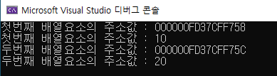

## Test 01.c 

> 함수는 메모리에 별도 공간이다.

* cheoli 출력값이 100이 아닌 0인 이유는 ? 함수는 메모리 별도의 공간이기 때문에 

  int cheoli = 0; 은 main에서만 만들어진 변수로 void assign() 함수와는 별개의 메모리 공간을 사용 
  따라서, void assign() 에도 cheoli 변수 선언이 필요하고 변수는 각 함수에 개별 동작 


```c
#include <stdio.h>

void assign(); //컴파일러에게 함수가 있다는 걸 알려줌 

int main() {
	//함수 2개 
	int cheoli = 0; // main에서만 만들어진 변수로 void assign() 함수와는 별개
				 // void assign() 에도 cheoli 변수 선언 필요 
	assign(); // 호출 
	printf("함수가 호출된 후에 cheoli에 저장된 값 : %d \n", cheoli);

	return 0;

}

void assign() {
	// 함수는 메모리에 별도 공간이다.
	// 함수는 호출시 작동한다. 
	int cheoli = 100; 
}

```


> 포인터 변수 활용 (주소값을 매개변수로 넘기기)★ 다시 이해하기 


```c
#include <stdio.h>

void assign(); 

int main() {
	int cheoli = 0; 
	assign(&cheoli); // &cheoli 주소를 넘겨주며 호출 
	printf("함수가 호출된 후에 cheoli에 저장된 값 : %d \n", cheoli);

	return 0;

}

void assign(int *ip) { // int main() 함수의 cheoli의 주소값을 매개변수로 받음
	// 함수는 메모리에 별도 공간이다.
	// 함수는 호출시 작동한다. 
	*ip = 100; // *ip가 가르키고 있는 cheoli (시작)주소값에 100 값을 넣음
}

```


## test2.c(문제) 포인터변수를 사용하여 두 변수 값 변경하기 

> 문제 

```c
#include <stdio.h>

int main() {
	int cheoli = 20, metel = 20;

	return 0;

}

void exchange() {
	//포인터 변수를 사용

}
```

## 질문하기@test2 꼭 원형 선언 해야하나요? 

> 정답 

```c
#include <stdio.h>

void exchange(int* cp, int* mp);//함수 원형 선언

int main() {
	int cheoli = 10, metel = 20;

	exchange(&cheoli, &metel);
	printf("%d %d", cheoli, metel);
	return 0;

}

void exchange(int *cp , int *mp) {
	//포인터 매개 변수 사용

	int temp;
	temp = *cp; 
	*cp = *mp;
	*mp = temp;
}
```

> 화면 


## test3.c 배열과 포인터 관계 

```
int ary[5] = { 10,20,30,40,50 };
int* ap;
	ap = &ary[0];
```

* int 는 4byte 단위  

​	100번지 : ary [  10  |     20    |  30   |   40   |   50 ]

   	       번지        100~3   104~7  108~11  .... 

> ​	ap = &ary[0] + 1 이 가르키는 것은 ? 

* ary[0]의 주소에서 한칸 건너 뛴  ary[1]의 주소  이다

* 101번지를 가르키는 것이 아닌 


```c
#include <stdio.h>

int main() {
	//배열과 포인터 관계
	int ary[5] = { 10,20,30,40,50 };
	int* ap;
	ap = &ary[0];

	printf("첫번째 배열요소의 주소값 : %p\n", ap); //주소
	printf("첫번째 배열요소의 주소값 : %d\n", *ap); //주소가 가르키는 값


	ap = &ary[0] + 1;

	printf("두번째 배열요소의 주소값 : %p\n", ap); //주소
	printf("두번째 배열요소의 주소값 : %d\n", *ap); //주소가 가르키는 값

	return 0;


}
```

> 화면 




> 배열명도 시작 주소값 ★

* 포인터 변수 선언 없이 배열의 시작 주소를 불러오는 방법
  * &ary 가 아닌 ary 그 자체로 %p 변환 문자열 사용 

```
	printf("배열명의 주소값은? %p\n", ary); //★ 배열명도 시작 주소값
```

* 포인터 변수 선언 없이 배열의 시작 주소 값을 불러오는 방법

```
    printf("배열의 첫번째 주소가 가지고 있는 값은? %d\n", *ary);  // 첫번째 배열 값 10 
    printf("배열의 두번째 주소가 가지고 있는 값은? %d\n", *(ary+i_);  // 두번째 배열 값 20
```


## test4.c 배열의 평균값 구하기 

> 배열 요소를 참조할 때는 배열명에 정수값을 더하는 포인터 표현을 사용하며, 평균은 소수점 둘째자리까지 출력 


> 내가 작성한 답

```c
#include <stdio.h>

int main() {
	double ary[] = { 1.5, 20.1, 16.4, 2.3, 3.5 };
	double sum=0;
	double* p;
	double avg=0;
	double arylen;

	arylen = sizeof(ary) / sizeof(double); //배열 크기 구할때 

	p = &ary[0];
	for (int i = 0; i < arylen; i++) {
		sum = sum + *(p + i);
	}

	avg = sum / arylen;

	printf("평균값 : %.2f\n", avg);
	
	return 0;


}
```


> 학원 닶

```c
#include <stdio.h>

int main() {
	double ary[] = { 1.5, 20.1, 16.4, 2.3, 3.5 };
	double tot = 0;
	double avg = 0;

	int i; 


	for ( i = 0; i < 5; i++) {
		//포인터 사용
		tot = tot + *(ary + i);  // 배열명도 시작 주소값이다.
	}

	avg = tot / 5;

	printf("평균값 : %.2f\n", avg);

	printf("두번째 배열의 값은? %f\n", *(ary+1)); //★ 배열명도 시작 주소값
	return 0;


}
```

​                                                                                                                                                                                                                                                                                                                                                                                                                                                                                                                                                                                                                                                                                                                                                                                                                                                                                                                                                                                                                                                                                                                                                                                                                                                                                                                                                                                                                                                                                                                                                                                                                                                                                                                                                                                                                                                                                                                                                                                                                                                                     

> 명심포인트 

* 배열명도 시작 주소값이다.


## test5.c

> 화면


> 코드


```
#include <stdio.h>

int main() {
	int ary[5] = { 10,20,30,40,50 };
	int* ap = ary;
	int i;

	printf("ap 시작주소 : %p\n", ap);
	printf("ary 시작주소: %p\n", ary);
	printf("ap 시작주소와 ary 시작주소는 동일\n");

	for (i = 0; i < 5; i++) {
		//방법1. printf("%5d", *(ap+i));
		
		//방법2.
		printf("%5d", *ap);
		ap = ap + 1;
	}

	return 0;

}
```


> 명심포인트

int* ap = ary;


## test6.c (문제) 함수, 포인터, 배열 활용 

> 아래 화면이 나오도록 괄호를 작성하시오


```
#include <stdio.h>

int main() {
	int ary[5] = { 10,20,30,40,50 };

	//( 1 )
	return 0;

}

void ary_prn(int* ap) {
	// 반복문으로 처리
    //( 2 ) 

}
```


> 정답 

```c
#include <stdio.h>

void ary_prn(int* ap); //반드시 적어줘야함 안적으면 ary_prn가 정의되지 않았습니다라고 뜸 

int main() {
	int ary[5] = { 10,20,30,40,50 };

	ary_prn(&ary); 
	return 0;
}

void ary_prn(int* ap) {
	// 반복문으로 처리

	for (int i = 0; i < 5; i++) {
		printf("%5d ", *ap++); 
		// 다른 방법 printf("%5d ", ap[i]);
		//다시 이해하기 ! 배열명도 시작주소, 포인터도 시작주소라 ap[i] 가 가능
		
	}

}
```


> 명심포인트 

* main() 함수보다 다른 함수가 뒤에 있다면 main() 함수 앞에 반드시 함수 원형 선언을 해줘야한다.

* printf("%5d ", *ap++); 
* printf("%5d ", ap[i]);


### test7.c (문제)

> 아래 화면처럼 출력하시오 


```
#include <stdio.h>

//(1)

int main() {
	int arr1[3] = { 1,2,3 };
	int arr2[5] = { 4,5,6,7,8 };
	
	showArayElem(arr1, sizeof(arr1) / sizeof(int));
	showArayElem(arr2, sizeof(arr2) / sizeof(int));

	return 0;
}

void showArayElem(2) {
	int i;
	for (i = 0; i < len; i++) {
		 // (3)
	}
}
```

> 정답 

```c
#include <stdio.h>

void showArayElem(int* p, int len);

int main() {
	int arr1[3] = { 1,2,3 };
	int arr2[5] = { 4,5,6,7,8 };
	
	showArayElem(arr1, sizeof(arr1) / sizeof(int));
	showArayElem(arr2, sizeof(arr2) / sizeof(int));

	return 0;
}

void showArayElem(int *param, int len) {
	int i;
	for (i = 0; i < len; i++) {
		printf("%5d", param[i]);
	}

	printf("\n");

}
```

## Test 8.c (문제)

> 함수를 사용하여 평균을 구하시오


```c
#include <stdio.h>

double ary_avg(int*);

int main() {
	int ary[5] = { 75,80,92,88,98 };
	double res; 
	res = ary_avg(ary);
	printf("배열의 평균은 : %2.1lf\n", res);

	return 0;
}

double ary_avg(int* param) {

	int sum = 0;
	double avg;
	for (int i = 0; i < 5; i++) {
		sum += param[i];
	}

	avg = sum / 5.0;
	return avg;
}
```

> 명심포인트 

* 배열명이 주소값이니깐 포인터 변수로 받아야함  > 포인터를 배열처럼 사용 가능


## test9.c 포인트 변수를 사용하여 배열의 최소값 구하기 


```c
#include<stdio.h>

double ary_min(double*);


int main() {
	double ary[] = { 1.5,20.1,16.4,2.3,3.5 };
	double res; 

	res = ary_min(ary); 
	printf("배열의 최소값 : %.1f\n",res);

	return 0;

}

double ary_min(double* param) {
	int i;
	double min;

	min = param[0];

	for (i = 0; i < 5; i++) {
		if (min > param[i]) {
			min = param[i];
		} 

	}

	return min;


}


```


## test10.c 키보로 값을 입력받아 평균값을 구하기 

> 문제 


```c
#include<stdio.h>

double ary_avg(int*);

int main() {
	int ary[5];
	int i;
	double res;
	int* ap;
	// 반복문이용하여 카보드로부터 데이터를 입력받은 후 평균계산
    ( 1) 
    
	res = ary_avg(ary);
	printf("배열의 평균은 : ");
	printf("%.2lf\n", res);

	return 0;

}

double ary_avg() {
   (2)

}
```

> 정답

```c
#include<stdio.h>

double ary_avg(int*);

int main() {
	int ary[5];
	int i;
	double res;
	int* ap;

	ap = ary;
	// 반복문이용하여 카보드로부터 데이터를 입력받은 후 평균계산
	for (i = 0; i < 5; i++) {
		scanf_s("%d", ap+i); 
	}

	res = ary_avg(ary);
	printf("배열의 평균은 : ");
	printf("%.2lf\n", res);

	return 0;
}

double ary_avg(int *ap) {
	int tot = 0;
	double avg;
	for (int i = 0; i < 5; i++) {
		tot += ap[i];

	}

	avg = tot / 5.0;
	return avg;
}
```

> 명심포인트

```
scanf_s("%d", ap+i); 
```


## test11.c

문자열의 주소값 

> 메모리에 저장되는 문자열의 시작주소값을 나타냄 

```
	printf("주소값을 출력 : %p\n","dream");
```

> 문자열 시작주소의 값을 나타낼 때 

```
	printf("첫번째 문자를 출력 : %c\n", *"dream");
```

> 시작주소로부터 두번째 떨어진 문자를 나타낼 때 

* 틀린답 : 번지수에 2를 더함 

```
	printf("세번째 문자를 출력 : %c\n", *"dream"+2);
```

* 올바른 답 : 두칸을 건너 뜀

```
	printf("세번째 문자를 출력 : %c\n", *("dream"+2));
	또는 
	printf("세번째 문자를 출력 : %c\n", "dream"[2]);
```


>  배열과 문자열 혼동 금지 

* 배열은 값을 저장하거나 바꿀 수 있음 

* 문자열은 코딩해서 넣으면 바꿀 수 없음 


> 코드 

```c
#include <stdio.h>

int main() {

	printf("주소값을 출력 : %p\n","dream");
	printf("첫번째 문자를 출력 : %c\n", *"dream");

	printf("세번째 주소를 출력 : %p\n", "dream" + 2);
	printf("세번째 문자를 출력 : %c\n", *("dream"+2));
	printf("세번째 문자를 출력 : %c\n", "dream"[2]);

	return 0;
}
```


### test12.c

```
char* name;
```

* 포인터 변수는 무조건 4byte

* 포인터 변수가 가르키는 타입이 char이라는 뜻 


> 문자열은 내부적으로 배열처럼 처리된다 ★ 

```c
#include <stdio.h> 

int main() {
	char* name;
	name = "Hong gildong"; //문자열은 내부적으로 배열처럼 처리된다 

	printf("이름 : %s\n", name);

	//6번째 문자 g 출력
	printf("6번째 문자 : %c\n", *(name+5));
	printf("6번째 문자 : %c\n", name[5]); 
	
}
```


## test13.c ★ 이해하기

> 문자열의 끝은 널문자 

```c
#include <stdio.h> 

int main() {

	char* fruit = "strawberry";

	while (*fruit != '\0') {
		printf("%s\n", fruit);
		fruit++;

	}

}
```


##   test 14.c 다시 이해하기 @@

* 배열명은 문자열을 가르키는 주소값이기 때문에 배열명만 적어줘도 출력됨

​       (문자열의 시작주소를 가르킴)

배열은 내부적으로 배열처럼 처리되지만 바꿀수 없다 

> 배열과 포인터 변수 

* 변수는 값이 변할 수 있어야 한다! 
* 따라서, str1[]  변수가 아니라 배열명이다. 
* 배열명은 문자열을 가르키는 주소값 

* 배열명은 해당되는 주소의 시작값 


* char* str2 의 str2는 변수다 
* 따라서, 값이 변경된다.


> str2[0] 의 값이 변경 안되는 이유 


> string 값으로 된 갓은 바꿀 수 없다. 

* 주소로 접근할 수 있어도 값을 바꿀 수 없음

* 배열에 저장했을때는 바꿀 수 있음 


```c
#include <stdio.h>

int main() {
	char str1[] = "My String"; //배열 (값 변경 불가)
	char* str2 = "Your String"; // 포인터 변수  (값 변경 가능)
	printf("%s\n", str1);
	printf("%s\n", str2);

	
	str2 = "Our String";
	printf("%s\n", str1);
	printf("%s\n", str2);


	str1[0] = 'x'; //배열 위치로 값을 변경 가능 
	//str2[0] = 'x';  결과 안나옴 //변수 = 값 
	//str2[0]은 주소를 가지고 있는 변수, str2[0]의 주소값을 가지고 있음
	printf("%s\n", str1);

	printf("%s\n", str2);
	printf("%c\n", str2[0]);

	

	return 0;

}
```

