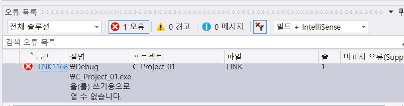
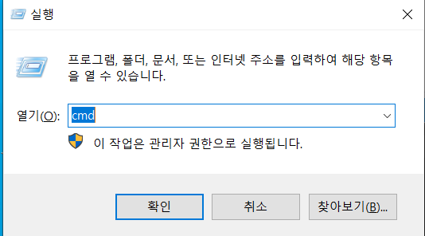
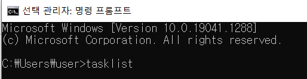
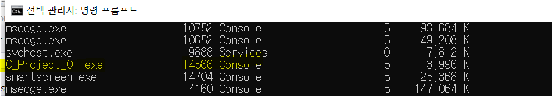
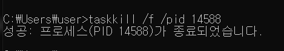
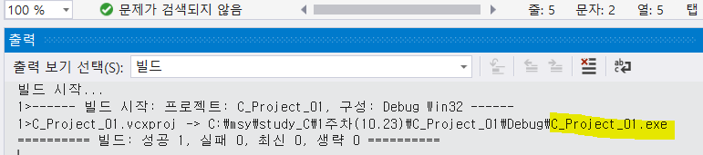

#### 오류 | 프로젝트.exe 을(를) 쓰기용으로 열 수 없습니다. 

> 오류 화면

* (내 프로젝트명.exe)**을(를) 쓰기용으로 열 수 없습니다.** 

  예 ) C_project_01.exe

> 해결방법

1. 관리자로 Cmd.exe 실행 

- 실행 창 단축키 : 윈도우 + R 

2. **tasklist** 입력 

3. 내 프로젝트 명.exe 의 콘솔 PID 확인 (프로젝트마다 PID 다름 주의)

   예) <u>C_project_01</u>.exe 콘솔 PID → 14588 

4. **taskkill /f /pid** <u>PID번호</u> 입력

   예) taskkill /f /pid 14588

5. 정상 작동 확인 

